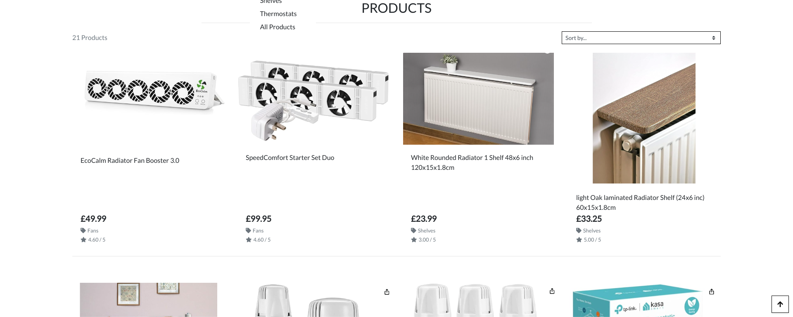
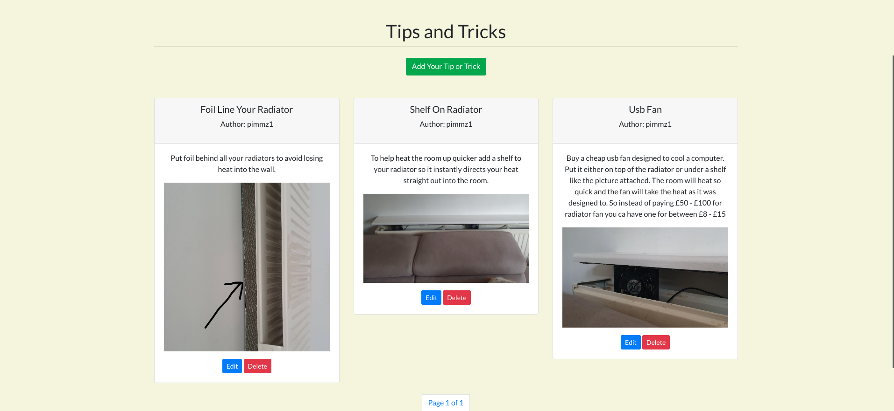
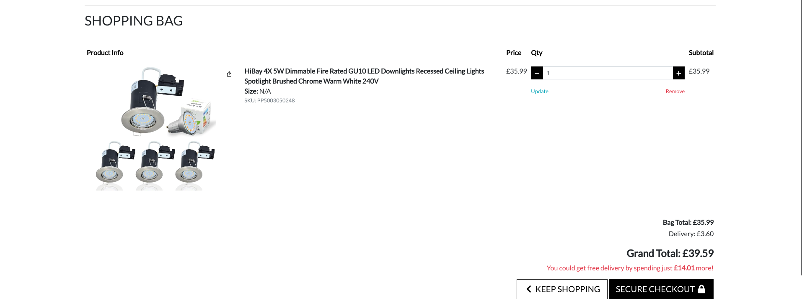
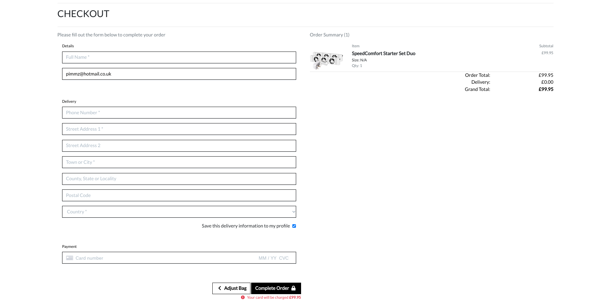
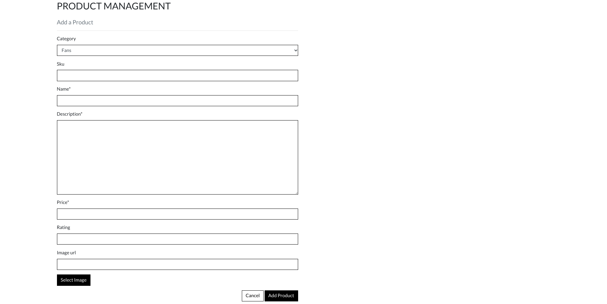

Facebook link 

Deployed site link - https://home-energy-saving-store-be6e9d82e03c.herokuapp.com/

mailchimp newsletter - https://us21.admin.mailchimp.com/reports/clickmap?id=12670381

fix merge error 

HOME ENERGY SAVING STORE

Welcome to the Home Energy Saving Store! The website was designed to help homeowners save energy,  reduce bills,  and combat pollution.  Targeting all eco-conscious individuals, we offer practical solutions for sustainable living. Join us in our commitment to a greener future while also positioning our business as a leader in sustainability, attracting a loyal customer base and fostering long-term profitability.

Here is a link to my project -[HOME ENERGY SAVING STORE](https://home-energy-saving-store-be6e9d82e03c.herokuapp.com)


## User Experience (UX)

When I started the design of the Home Energy Saving Store I wanted to ensure the site was Useful, Useable and Valuable so that it makes the user experience informative and enjoyable. To do this I looked at the five key fundamentals;

Strategy - So the user can discover, Learn, enjoy, interact and get assistance with all things to do with saving energy at home.

Scope - Based on the information from the strategy, the features included emotive images. A Contact us section so that the users can contact the store about returning a product and item not being delivered ot anything else. Plus you have the ability to subcribe to the sight to get exculsives offers and news from the store. The Tips and Tricks page enables the user to post a picture of their ideas and suggestions on how to save money from ingenuitive ideas. The FAQ page or Frequesntly asked questions is another area designed to help the users of the site to understand whether certain tasks around the home are beneficial or not.

Structure - This was designed around the user. After speaking with a number of energy saving people, to be about to contact the store. To be able to post their own ideas on how to save money with out having to pay for it. Plus an area to read the basics on saving energy for the newer users visting the site.

Skeleton - As before this was designed around the user which was gained from information supplied by a number of energy saving people. This dictated that it would be laid out simply. So that it can be used quickly and efficiently while delivering the most amount of information and receiving help depending on the user's needs.

Surface - I wanted the look of the Home Energy Saving Store to be informative, clear, and concise, with consistent typography and corresponding colours to help them stand out, to easily navigate with emotive pictures that helped to raise awareness about reducing pollution and greenhouse gases to help the environment and save the user money.

Then I sat down and roughly sketched out onto paper what the screens would look like on a mobile, tablet and desktop, This then gave me the basis to start creating the Home Energy Saving Store in Codeanywhere.
<details>

<summary>Rough Sketch</summary>


</details>

### Colour Scheme

The website primarily features a slick black `#000000` and white `#ffffff` colour scheme, particularly chosen to ensure a striking contrast between backgrounds and text. this deliberate contrast allows the images of the featured products to leap off the page, captivating users and enhancing their appeal, thereby bolstering sales.

To enhance readability and use experience on error pages, contact us, tips and tricks and faq. I've opted for a subtle beige background `#f5f5dc` background paired with crisp black text `#000000` this deliberate contrast not only improves legibility but also contributes to a visual appealing design.

I've used [colorcodes](https://htmlcolorcodes.com) To source my colours.

### Typography

I looked for fonts on Google Fonts, to help me decide as it gave a better visual aid for me to see how they all looked in their different weights. After many hours trying the fonts out, I decided to use Lato all the way through to ensure a good balance, with a consistent look and feel. As a backup, I used sans-serif as it has a great look and then my third choice was serif as a fallback in case the other two weren't available.

- [Lato](https://fonts.google.com/specimen/Lato) was used for all the text and headers.

- [Sans serif](https://fonts.google.com/knowledge/glossary/sans_serif) was used for the backup font.

## User Stories

#### EPIC | Viewing and Navigation

- As a shopper I can contact the store so that I can make a query about something or return a product
- As a shopper I can view frequently asked questions so that I can quickly learn and answer energy saving questions that I may have
- As a Shopper I can view tips and tricks so that I can learn from other user what they have done to save money on my heating and electricity costs
- As a Shopper I can find the store on Facebook so that I can easily find it and trust its authenticity
- As a Shopper I can easily view the total of my purchases at any time so that I can avoid spending too much
- As a Shopper I can view individual products details so that I can identify the price, description, product rating, product image and available sizes
- As a Shopper I can view a specific category of products so that I can quickly find products I'm interested in without having to search through all the products
- As a shopper I can view a list of products so that I can select some to purchase

#### EPIC | Registration and User Accounts
- As a Site user I can have a personalised user profile so that I can view my personal order history and order confirmations and save my payment information
- As a Shopper I can Subscribe to to get exclusive offers and News so that I can stay upto date with new and exciting energy saving products as well as exclusive offers and discounts
- As a Site user I can receive an email confirmation after registering so that I can verify that my account registration was successful
- As a Shopper I can Easily recover my password in case I forget it so that I can recover access to my account
- As a Site User easily login or log out do so that I can access my personal account information
- As a Site user I can easily registered for an account so that I can have a personal account and be able to view my profile

#### EPIC | Sorting and Searching
- As a Shopper I can Search for a product by name or description so that I can find a specific product I'd like to purchase
- As a Shopper I can sort multiple categories of products simultaneously so that I can find the best price or best rated products across a broad categories
- As a Shopper I can sort a specific category of product so that I can find the best priced or best rated product in a specific category or sort the product in that 	 
category by name
- As a Shopper I can sort the list of available products so that I can easily identify the best rated best priced and categorically sorted products

#### EPIC | Purchasing and Checkout
- As a Shopper I can receive an email confirmation after checking out so that I can keep the confirmation of what I've purchased for my record
- As a Shopper I can view an order confirmation after checkout so that I can verify that I haven't made any mistakes
- As a Shopper I can Feel my personal and payment information is safe and secure so that I can confidently provide the needed information to make a purchase
- As a Shopper I can easily enter my payment information so that I can check out quickly and with no hassles
- As a Shopper I can Adjust the quantity of individual items in my bag so that I can easily make changes to my purchase before checkout
- As a Shopper I can view items in my bag to be purchased so that I can identify the total cost of my purchase and all items I will receive
- As a Shopper I can easily select the size and quantity of a product when purchasing it so that I can ensure I don't accidentally select the wrong product quantity or size

#### EPIC | Admin and Store Management
- As a Store Owner I can delete a product so that I can remove items that are no longer for sale
- As a Store Owner I can edit/ update a product so that I can change product prices descriptions images and other product criteria
- As a Store Owner I can add a product so that I can add new items to my store


## Wireframes

<details>

<summary>Home Page</summary>


</details>

<details>

<summary>All Products Page</summary>


</details>

<details>

<summary>Individual Categories Page</summary>


</details>

<details>

<summary>Contact Us Page</summary>


</details>

<details>

<summary>Tips and Tricks Page</summary>


</details>

<details>

<summary>FAQ Page</summary>


</details>

<details>

<summary>Shopping Basket Page</summary>


</details>

<details>

<summary>Checkout Page</summary>


</details>

<details>

<summary>Product Management Page</summary>


</details>

I've used [Balsamiq](https://balsamiq.com/wireframes) to design my site wireframes.

## Features

### Existing Features

- **Header**


- Title of the website to ensure users know exactly where they are.
- Search facility so the user can find the products quickly that are sold on the site
- My account section so the user can find their details, log out and if authorised, manage products.
- The basket link so the user can see the amount they have put in their basket at a glance of a eye. Plus when clicked it opend up the basket with more detail.

- **Navigation Bar**


- The navigation bar is present at the top of every page and includes all links to the various other pages.
- The Tips and Tricks page as well as the FAQ will only open if you are signed in. If you are not a sign in message comes up asking you to sign in. 

- **Footer**


- The about section to explain abit about Hess and why we operate
- The footer section includes links to our Facebook page, FAQ, Tips and tricks and the contact page.
- Clicking the links in the footer opens a separate browser tab to avoid pulling the user away from the site.

- **Home Page**


- Description of our website and what we're about so users can decide if it's for them.
- Eye catching background image to display a green eco friendly money saving theme.
- Big Text displaying exciting message about New products with a shop now button to get the users to explore our products for sale.
- Banner to draw attention for users to subscribe and get exculsive offers and a reminder that the the delivery fee is free for orders over £50

- **All Products Page**


- Clear title explaining the section
- All the products displayed for the user to look at and dedcide if they wish to buy it.
- A sort facility so the user can sort how they look at the product.
- A number count in the top left hand part of the screen to show how many products are for sale.
  
- **Individual Category Pages**


- Clear title explaining the section
- Clear category title explaining the section
- All the products displayed for the user to look at and dedcide if they wish to buy it.
- A sort facility so the user can sort how they look at the product.
- A number count in the top left hand part of the screen to show how many products are for sale.

- **Contact Pages**


- Form to fill in so the user can enquire about a return, item not delivered or something else.
- Submit button to send the application form onwards
- Cancel button to redirect the user back if they have changed their mind.
- Confirmation message that the form has been successfully submitted.

- **Tips and Tricks Page**


- Clear title explaining the section with a big button for you to add your tip or trick
- Delete button to allow the registered user to delete the tip or trick they have submitted in case they change their mind.
- Edit button to allow the registered user to edit the tip or trick they have submitted in case they change their mind.
- Page number at the bottom so the user knows which page they are currently on.
- Next and previous button so the user can navigate between pages when there are more than six tips or tricks per page.

- **Frequently Asked Questions Page**


- Clear title explaining the section
- Questions arranged in numerical order answering the most commonly raised questions in regard to saving energy

- **Basket Page**


- Clear concise area to show what the user has put in their basket and how much it would cost.
- Qty button to change the amount the user has requested if they want to.
- Update button to update the basket total if the qty is changed.
- Remove button to remove the items in the basket.
- Keep shopping button so the user can continue their shopping.
- Secure checkout button when they are ready to pay for their goods.
 
- **Checkout Page**


- Clear concise area to show what the user is purchasing and how much it would cost.
- A clear form for the user to fill in for their name, address and card details.
- Adjust bag button to update the basket total if there is a need for change.
- Complate Order button when they are ready to pay for their goods.

- **Product management Page**


- Area for the administrators to add additional products to their website.
- A clear form to fill in for the prodcts details.
- Cancel button to redirect them back if they have changed their mind.
- Add product button when they are ready to add it to their website.

- **My Profile Page**


- A clear form for the user to check and fill in for their name, address if its has changed.
- Update information if they wish to change there information


### Error Pages

Custom Error Pages were created to give the user more information on the error and to guide them back to the site.


- 400 Bad Request - Oh No! Looks like you made a bad request.
- 403 Page Forbidden - Sorry thats a Forbidden request.
- 404 Page Not Found - Sorry! that page is Not Found.
- 500 Server Error - Oh No! Sorry theres a Server Error

### Future Features

The following user stories were scoped out of the project due to skill level It is intended that these user stories will be implemented at a later date when I have the suficiant skills to complete them.

- As a user, I can track where my delivery is so i know what time it will be arriving


## Tools & Technologies Used

- [HTML](https://en.wikipedia.org/wiki/HTML) used for the main site content.
- [CSS](https://en.wikipedia.org/wiki/CSS) used for the main site design and layout.
- [CSS Flexbox](https://www.w3schools.com/css/css3_flexbox.asp) used for an enhanced responsive layout.
- [JavaScript](https://www.javascript.com) used for user interaction on the site.
- [Python](https://www.python.org) is used as the back-end programming language.
- [Git](https://git-scm.com) used for version control. (`git add`, `git commit`, `git push`)
- [GitHub](https://github.com) used for secure online code storage.
- [codeanywhere](https://app.codeanywhere.com/) used as a cloud-based IDE for development.
- [Bootstrap](https://getbootstrap.com) is used as the front-end CSS framework for modern responsiveness and pre-built components.
- [Django](https://www.djangoproject.com) used as the Python framework for the site.
- [Django-allauth](https://django-allauth.readthedocs.io/en/latest/installation.html): authentication library used to create the user accounts
- [ElephantSQL](https://www.elephantsql.com) used as the Postgres database.
- [Heroku](https://www.heroku.com) used for hosting the deployed back-end site.
- [Cloudinary](https://cloudinary.com) is used for online static file storage.
- [Balsamiq](https://balsamiq.com/) - Used to generate Wireframe images.
- [Chrome Dev Tools](https://developer.chrome.com/docs/devtools/) - Used for overall development and tweaking, including testing responsiveness and performance.
- [Font Awesome](https://fontawesome.com/) - Used for icons in the information bar.
- [Google Fonts](https://fonts.google.com/) - Used to import and alter fonts on the page.
- [W3C](https://www.w3.org/) - Used for HTML & CSS Validation.
- [Jshint](https://jshint.com/) - used to validate javascript
- [Colorcodes](https://htmlcolorcodes.com) - used for the colours in the site.
- [Favicon](https://favicon.io/) - Used to create the favicon.
- [Lucidchart](https://lucid.app/documents#/dashboard) - used to create the database schema design
- [Grammerly](https://app.grammarly.com/) - used to proofread the README.md
- [Summernote](https://summernote.org/): A WYSIWYG editor to allow users to edit their posts
- [Crispy Forms](https://django-crispy-forms.readthedocs.io/en/latest/) used to manage Django Forms

## Database Design

- I used principles of Object-Oriented Programming throughout this project and Django’s Class-Based Generic Views.
- Below is an example of the model I used for my Tips and Tricks page

```python
class TipsAndTricks(models.Model):

    title = models.CharField(max_length=200, unique=True, default='')
    author = models.ForeignKey(User, on_delete=models.CASCADE, default='')
    featured_image = CloudinaryField('image', default='placeholder')
    content = models.TextField('Content')
    is_approved = models.BooleanField(default=False)
    created_at = models.DateTimeField(default=timezone.now)
    slug = models.SlugField(unique=True, blank=True, null=True)

    def save(self, *args, **kwargs):
        if not self.slug:   
            self.slug = slugify(self.title)
        super().save(*args, **kwargs)
```
- Using Markdown formatting to represent an ERD table the Tips and model above would look like this:

- Table: **Tips and Tricks**

    | **PK** | **Attribute** | Type | Notes |
    | --- | --- | --- | --- |
    | **PK** | id | Integer | Primary Key |
	| **FK** | title| CharField | unique title of the tip |
    | **PK** | author_id | Foreignkey | Foreign key to user model |
    | **PK** | featured_image| CloudianryField | Image field |
    | **PK** | content | TextField | Content of the tip or trick |
    | **PK** | is_approved | BooleanField | Approval status|
    | **PK** | created_at | DateTimeField | Creation Timestamp |
    | **PK** | slug | SlugField | Uniques slug for url |
    
🛑🛑🛑🛑🛑 AM I OK WITH JUST ONE MODEL ? 🛑🛑🛑🛑🛑

- To help organise the remaining models required I used [Lucidchart](https://lucid.app/lucidchart/0a00742c-aa55-4964-8626-cff679e4ba5b/edit?viewport_loc=-476%2C20%2C3384%2C1572%2C0_0&invitationId=inv_85e6fc15-610f-42fe-b2bf-59e51136a95c)


## Agile Development Process

### GitHub Projects

[GitHub Projects](https://github.com/Pimmz/Home-Energy-Saving-Store/projects) served as an Agile tool for this project.
It isn't a specialized tool, but with the right tags and project creation/issue assignments, it can be made to work.

Through it, user stories, issues, and milestone tasks were planned, then tracked on a weekly basis using the basic Kanban board.


### GitHub Issues

[GitHub Issues](https://github.com/Pimmz/Home-Energy-Saving-Store/issues) served as an another Agile tool.
There, I used my own **User Story Template** to manage user stories.

It also helped with milestone iterations on a weekly basis.

- [Open Issues](https://github.com/Pimmz/Home-Energy-Saving-Store/issues)

    

- [Closed Issues](https://github.com/Pimmz/Home-Energy-Saving-Store/issues?q=is%3Aissue+is%3Aclosed)

    

### MoSCoW Prioritization

I've decomposed my Epics into stories prior to prioritizing and implementing them.
Using this approach, I was able to apply the MoSCow prioritization and labels to my user stories within the Issues tab.

- **Must Have**: guaranteed to be delivered (*max 60% of stories*)
- **Should Have**: adds significant value, but not vital (*the rest ~20% of stories*)
- **Could Have**: has small impact if left out (*20% of stories*)
- **Won't Have**: not a priority for this iteration

## Ecommerce Business Model

This site sells goods to individual customers, and therefore follows a `Business to Customer` model.
It is of the simplest **B2C** forms, as it focuses on individual transactions, and doesn't need anything
such as monthly/annual subscriptions.

It is still in its early development stages, although it already has a newsletter, and links for social media marketing.

Social media can potentially build a community of users around the business, and boost site visitor numbers,
especially when using larger platforms such a Facebook.

A newsletter list can be used by the business to send regular messages to site users.
For example, what items are on special offer, new items in stock,
updates to business hours, notifications of events, and much more!

## Search Engine Optimization (SEO) & Social Media Marketing

### Keywords

I've identified some appropriate keywords to align with my site, that should help users
when searching online to find my page easily from a search engine.
This included a series of the following keyword types

- Short-tail (head terms) keywords
- Long-tail keywords

I also played around with [Word Tracker](https://www.wordtracker.com) a bit
to check the frequency of some of my site's primary keywords (only until the free trial expired).

### Sitemap

I've used [XML-Sitemaps](https://www.xml-sitemaps.com) to generate a sitemap.xml file.
This was generated using my deployed site URL: https://home-energy-saving-store-be6e9d82e03c.herokuapp.com

After it finished crawling the entire site, it created a
[sitemap.xml](sitemap.xml) which I've downloaded and included in the repository.

### Robots

I've created the [robots.txt](robots.txt) file at the root-level.
Inside, I've included the default settings:

```
User-agent: *
Disallow:
Sitemap: https://home-energy-saving-store-be6e9d82e03c.herokuapp.com/sitemap.xml
```

Further links for future implementation:
- [Google search console](https://search.google.com/search-console)
- [Creating and submitting a sitemap](https://developers.google.com/search/docs/advanced/sitemaps/build-sitemap)
- [Managing your sitemaps and using sitemaps reports](https://support.google.com/webmasters/answer/7451001)
- [Testing the robots.txt file](https://support.google.com/webmasters/answer/6062598)

### Social Media Marketing

Creating a strong social base (with participation) and linking that to the business site can help drive sales.
Using more popular providers with a wider user base, such as Facebook, typically maximizes site views.

I've created a mockup Facebook business account using the
[Balsamiq template](https://code-institute-org.github.io/5P-Assessments-Handbook/files/Facebook_Mockups.zip)
provided by Code Institute.

Ive created my Facebook Business Page. Here is the link link - [Facebook](https://www.facebook.com/profile.php?id=61554298768912) 

Ive alkso included a screenshot in case Facebook take down my business page

### Newsletter Marketing

I have incorporate a newsletter sign-up form on my application, to allow users to supply their
email address if they are interested in learning more. 

🛑🛑🛑🛑🛑 START OF NOTES (to be deleted) 🛑🛑🛑🛑🛑

Option 1 (MailChimp):
- Sign up for a Mailchimp account
- This allows up to 2,500 subscription email sends per month
- Incorporate the code and scripts into your project like in the CI lessons.

Option 2 (Django):
- Create a custom newsletter app in your project, with a custom model.
- This method satisfies two assessment criteria:
    - include a newsletter
    - one of your custom models
- It doesn't need anything except the "email" on the model.
- Example:
    ```python
    class Newsletter(models.Model):
    email = models.EmailField(null=False, blank=False)

    def __str__(self):
        return self.email
    ```
- Consider using the same `send_mail()` functionality used on the `webhook_handler.py` file.
    - You can trigger an email sent out to subscribed users when new products are added to the site!

🛑🛑🛑🛑🛑 END OF NOTES (to be deleted) 🛑🛑🛑🛑🛑

## Security Features and Defensive Design

### User Authentication

- Django's @method_decorator is used to make sure that any requests to access secure pages by non-authenticated users are redirected to the signup page.
- I have also used Django's LoginRequiredMixin to highlight the use of both for class based views. Which is used to make sure that any requests to access secure pages by non-authenticated users are redirected to the signup page.
- Django's conditional statement  was also used to ensure certain pages were only accessible to logged-in users.

### Form Validation

- If incorrect or empty data is added to a form, the form won't submit and a warning will appear to the user informing them what field raised the error.

### Database Security

- The database URL and secret key are stored in the env.py file to prevent unwanted connections to the database and this was set up before the first push to
  Github.
- Cross-Site Request Forgery (CSRF) tokens were used on all forms throughout this site.

### Custom Error Pages

- Custom Error Pages were created to give the user more information on the error and to provide them with buttons to guide them back to the site.

- 400 Bad Request - Error 400 "Bad Request" Oh No! Looks like you made a bad request.
- 403 Page Forbidden - Error 403 "Forbidden Request" Sorry thats a Forbidden request.
- 404 Page Not Found - Error 404 "Not Found" Yikes! that page is Not Found.
- 500 Server Error - Error 500 "Internal Server Error" Oh No! Dont worry its me! not you!

## Testing

For all testing, please refer to the [TESTING.md](TESTING.md) file.

## Deployment

The live deployed application can be found deployed on [Heroku](https://home-energy-saving-store-be6e9d82e03c.herokuapp.com).

### ElephantSQL Database

This project uses [ElephantSQL](https://www.elephantsql.com) for the PostgreSQL Database.

To obtain your own Postgres Database, sign-up with your GitHub account, then follow these steps:

- Click **Create New Instance** to start a new database.
- Provide a name (this is commonly the name of the project: Home-Energy-Saving-Store).
- Select the **Tiny Turtle (Free)** plan.
- You can leave the **Tags** blank.
- Select the **Region** and **Data Center** closest to you.
- Once created, click on the new database name, where you can view the database URL and Password.

### Cloudinary API

This project uses the [Cloudinary API](https://cloudinary.com) to store media assets online, due to the fact that Heroku doesn't persist this type of data.

To obtain your own Cloudinary API key, create an account and log in.

- For *Primary interest*, you can choose *Programmable Media for image and video API*.
- Optional: *edit your assigned cloud name to something more memorable*.
- On your Cloudinary Dashboard, you can copy your **API Environment Variable**.
- Be sure to remove the `CLOUDINARY_URL=` as part of the API **value**; this is the **key**.

### Amazon AWS

This project isnt using AWS but if it did you could uses it at [AWS](https://aws.amazon.com) to store media and static files online, due to the fact that Heroku doesn't persist this type of data.

Once you've created an AWS account and logged-in, follow these series of steps to get your project connected.
Make sure you're on the **AWS Management Console** page.

#### S3 Bucket

- Search for **S3**.
- Create a new bucket, give it a name (matching your Heroku app name), and choose the region closest to you.
- Uncheck **Block all public access**, and acknowledge that the bucket will be public (required for it to work on Heroku).
- From **Object Ownership**, make sure to have **ACLs enabled**, and **Bucket owner preferred** selected.
- From the **Properties** tab, turn on static website hosting, and type `index.html` and `error.html` in their respective fields, then click **Save**.
- From the **Permissions** tab, paste in the following CORS configuration:

	```shell
	[
		{
			"AllowedHeaders": [
				"Authorization"
			],
			"AllowedMethods": [
				"GET"
			],
			"AllowedOrigins": [
				"*"
			],
			"ExposeHeaders": []
		}
	]
	```

- Copy your **ARN** string.
- From the **Bucket Policy** tab, select the **Policy Generator** link, and use the following steps:
	- Policy Type: **S3 Bucket Policy**
	- Effect: **Allow**
	- Principal: `*`
	- Actions: **GetObject**
	- Amazon Resource Name (ARN): **paste-your-ARN-here**
	- Click **Add Statement**
	- Click **Generate Policy**
	- Copy the entire Policy, and paste it into the **Bucket Policy Editor**

		```shell
		{
			"Id": "Policy1234567890",
			"Version": "2012-10-17",
			"Statement": [
				{
					"Sid": "Stmt1234567890",
					"Action": [
						"s3:GetObject"
					],
					"Effect": "Allow",
					"Resource": "arn:aws:s3:::your-bucket-name/*"
					"Principal": "*",
				}
			]
		}
		```

	- Before you click "Save", add `/*` to the end of the Resource key in the Bucket Policy Editor (like above).
	- Click **Save**.
- From the **Access Control List (ACL)** section, click "Edit" and enable **List** for **Everyone (public access)**, and accept the warning box.
	- If the edit button is disabled, you need to change the **Object Ownership** section above to **ACLs enabled** (mentioned above).

#### IAM

Back on the AWS Services Menu, search for and open **IAM** (Identity and Access Management).
Once on the IAM page, follow these steps:

- From **User Groups**, click **Create New Group**.
	- Suggested Name: `group-home-energy-saving-store` (group + the project name)
- Tags are optional, but you must click it to get to the **review policy** page.
- From **User Groups**, select your newly created group, and go to the **Permissions** tab.
- Open the **Add Permissions** dropdown, and click **Attach Policies**.
- Select the policy, then click **Add Permissions** at the bottom when finished.
- From the **JSON** tab, select the **Import Managed Policy** link.
	- Search for **S3**, select the `AmazonS3FullAccess` policy, and then **Import**.
	- You'll need your ARN from the S3 Bucket copied again, which is pasted into "Resources" key on the Policy.

		```shell
		{
			"Version": "2012-10-17",
			"Statement": [
				{
					"Effect": "Allow",
					"Action": "s3:*",
					"Resource": [
						"arn:aws:s3:::your-bucket-name",
						"arn:aws:s3:::your-bucket-name/*"
					]
				}
			]
		}
		```
	
	- Click **Review Policy**.
	- Suggested Name: `policy-home-energy-saving-store` (policy + the project name)
	- Provide a description:
		- "Access to S3 Bucket for home-energy-saving-store static files."
	- Click **Create Policy**.
- From **User Groups**, click your "group-home-energy-saving-store".
- Click **Attach Policy**.
- Search for the policy you've just created ("policy-home-energy-saving-store") and select it, then **Attach Policy**.
- From **User Groups**, click **Add User**.
	- Suggested Name: `user-home-energy-saving-store` (user + the project name)
- For "Select AWS Access Type", select **Programmatic Access**.
- Select the group to add your new user to: `group-home-energy-saving-store`
- Tags are optional, but you must click it to get to the **review user** page.
- Click **Create User** once done.
- You should see a button to **Download .csv**, so click it to save a copy on your system.
	- **IMPORTANT**: once you pass this page, you cannot come back to download it again, so do it immediately!
	- This contains the user's **Access key ID** and **Secret access key**.
	- `AWS_ACCESS_KEY_ID` = **Access key ID**
	- `AWS_SECRET_ACCESS_KEY` = **Secret access key**

#### Final AWS Setup

- If Heroku Config Vars has `DISABLE_COLLECTSTATIC` still, this can be removed now, so that AWS will handle the static files.
- Back within **S3**, create a new folder called: `media`.
- Select any existing media images for your project to prepare them for being uploaded into the new folder.
- Under **Manage Public Permissions**, select **Grant public read access to this object(s)**.
- No further settings are required, so click **Upload**.

### Stripe API

This project uses [Stripe](https://stripe.com) to handle the ecommerce payments.

Once you've created a Stripe account and logged-in, follow these series of steps to get your project connected.

- From your Stripe dashboard, click to expand the "Get your test API keys".
- You'll have two keys here:
	- `STRIPE_PUBLIC_KEY` = Publishable Key (starts with **pk**)
	- `STRIPE_SECRET_KEY` = Secret Key (starts with **sk**)

As a backup, in case users prematurely close the purchase-order page during payment, we can include Stripe Webhooks.

- From your Stripe dashboard, click **Developers**, and select **Webhooks**.
- From there, click **Add Endpoint**.
	- `https://home-energy-saving-store-be6e9d82e03c.herokuapp.com/checkout/wh/`
- Click **receive all events**.
- Click **Add Endpoint** to complete the process.
- You'll have a new key here:
	- `STRIPE_WH_SECRET` = Signing Secret (Wehbook) Key (starts with **wh**)

### Gmail API

This project uses [Gmail](https://mail.google.com) to handle sending emails to users for account verification and purchase order confirmations.

Once you've created a Gmail (Google) account and logged-in, follow these series of steps to get your project connected.

- Click on the **Account Settings** (cog icon) in the top-right corner of Gmail.
- Click on the **Accounts and Import** tab.
- Within the section called "Change account settings", click on the link for **Other Google Account settings**.
- From this new page, select **Security** on the left.
- Select **2-Step Verification** to turn it on. (verify your password and account)
- Once verified, select **Turn On** for 2FA.
- Navigate back to the **Security** page, and you'll see a new option called **App passwords**.
- This might prompt you once again to confirm your password and account.
- Select **Mail** for the app type.
- Select **Other (Custom name)** for the device type.
	- Any custom name, such as "Django" or Home-Energy-Saving-Store
- You'll be provided with a 16-character password (API key).
	- Save this somewhere locally, as you cannot access this key again later!
	- `EMAIL_HOST_PASS` = user's 16-character API key
	- `EMAIL_HOST_USER` = user's own personal Gmail email address

### Heroku Deployment

This project uses [Heroku](https://www.heroku.com), a platform as a service (PaaS) that enables developers to build, run, and operate applications entirely in the cloud.

Deployment steps are as follows, after account setup:

- Select **New** in the top-right corner of your Heroku Dashboard, and select **Create new app** from the dropdown menu.
- Your app name must be unique, and then choose a region closest to you (EU or USA), and finally, select **Create App**.
- From the new app **Settings**, click **Reveal Config Vars**, and set your environment variables.

| Key | Value |
| --- | --- |
| `CLOUDINARY_URL` | user's own value |
| `DATABASE_URL` | user's own value |
| `AWS_ACCESS_KEY_ID` | user's own value |
| `AWS_SECRET_ACCESS_KEY` | user's own value |
| `DATABASE_URL` | user's own value |
| `DISABLE_COLLECTSTATIC` | 1 (*this is temporary, and can be removed for the final deployment*) |
| `EMAIL_HOST_PASS` | user's own value |
| `EMAIL_HOST_USER` | user's own value |
| `SECRET_KEY` | user's own value |
| `STRIPE_PUBLIC_KEY` | user's own value |
| `STRIPE_SECRET_KEY` | user's own value |
| `STRIPE_WH_SECRET` | user's own value |
| `USE_AWS` | True |

Heroku needs two additional files in order to deploy properly.

- requirements.txt
- Procfile

You can install this project's **requirements** (where applicable) using:

- `pip3 install -r requirements.txt`

If you have your own packages that have been installed, then the requirements file needs updated using:

- `pip3 freeze --local > requirements.txt`

The **Procfile** can be created with the following command:

- `echo web: gunicorn app_name.wsgi > Procfile`
- *replace **app_name** with the name of your primary Django app name; the folder where settings.py is located*

For Heroku deployment, follow these steps to connect your own GitHub repository to the newly created app:

Either:

- Select **Automatic Deployment** from the Heroku app.

Or:

- In the Terminal/CLI, connect to Heroku using this command: `heroku login -i`
- Set the remote for Heroku: `heroku git:remote -a app_name` (replace *app_name* with your app name)
- After performing the standard Git `add`, `commit`, and `push` to GitHub, you can now type:
	- `git push heroku main`

The project should now be connected and deployed to Heroku!

### Local Deployment

This project can be cloned or forked in order to make a local copy on your own system.

For either method, you will need to install any applicable packages found within the *requirements.txt* file.

- `pip3 install -r requirements.txt`.

You will need to create a new file called `env.py` at the root-level,
and include the same environment variables listed above from the Heroku deployment steps.

Sample `env.py` file:

```python
import os

os.environ.setdefault("CLOUDINARY_URL", "user's own value")
os.environ.setdefault("AWS_ACCESS_KEY_ID", "user's own value")
os.environ.setdefault("AWS_SECRET_ACCESS_KEY", "user's own value")
os.environ.setdefault("DATABASE_URL", "user's own value")
os.environ.setdefault("EMAIL_HOST_PASS", "user's own value")
os.environ.setdefault("EMAIL_HOST_USER", "user's own value")
os.environ.setdefault("SECRET_KEY", "user's own value")
os.environ.setdefault("STRIPE_PUBLIC_KEY", "user's own value")
os.environ.setdefault("STRIPE_SECRET_KEY", "user's own value")
os.environ.setdefault("STRIPE_WH_SECRET", "user's own value")

# local environment only (do not include these in production/deployment!)
os.environ.setdefault("DEBUG", "True")
```

Once the project is cloned or forked, in order to run it locally, you'll need to follow these steps:

- Start the Django app: `python3 manage.py runserver`
- Stop the app once it's loaded: `CTRL+C` or `⌘+C` (Mac)
- Make any necessary migrations: `python3 manage.py makemigrations`
- Migrate the data to the database: `python3 manage.py migrate`
- Create a superuser: `python3 manage.py createsuperuser`
- Load fixtures (if applicable): `python3 manage.py loaddata file-name.json` (repeat for each file)
- Everything should be ready now, so run the Django app again: `python3 manage.py runserver`

If you'd like to backup your database models, use the following command for each model you'd like to create a fixture for:

- `python3 manage.py dumpdata your-model > your-model.json`
- *repeat this action for each model you wish to backup*

#### Cloning

You can clone the repository by following these steps:

1. Go to the [GitHub repository](https://github.com/Pimmz/Home-Energy-Saving-Store) 
2. Locate the Code button above the list of files and click it 
3. Select if you prefer to clone using HTTPS, SSH, or GitHub CLI and click the copy button to copy the URL to your clipboard
4. Open Git Bash or Terminal
5. Change the current working directory to the one where you want the cloned directory
6. In your IDE Terminal, type the following command to clone my repository:
	- `git clone https://github.com/Pimmz/Home-Energy-Saving-Store.git`
7. Press Enter to create your local clone.

Alternatively, if using Gitpod, you can click below to create your own workspace using this repository.

[](https://gitpod.io/#https://github.com/Pimmz/Home-Energy-Saving-Store)

Please note that in order to directly open the project in Gitpod, you need to have the browser extension installed.
A tutorial on how to do that can be found [here](https://www.gitpod.io/docs/configure/user-settings/browser-extension).

#### Forking

By forking the GitHub Repository, we make a copy of the original repository on our GitHub account to view and/or make changes without affecting the original owner's repository.
You can fork this repository by using the following steps:

1. Log in to GitHub and locate the [GitHub Repository](https://github.com/Pimmz/Home-Energy-Saving-Store)
2. At the top of the Repository (not top of page) just above the "Settings" Button on the menu, locate the "Fork" Button.
3. Once clicked, you should now have a copy of the original repository in your own GitHub account!

### Local VS Deployment

When I first deployed the site there was a difference between the local and the deployed site. The issue was the CSS wasn't coming through to the live site. Then I realised that I had committed with Debug set to true. Changing this over to false soon allowed the issue to be rectified

### Content

| Source | Location | Notes |
| --- | --- | --- |
| [Markdown Builder](https://tim.2bn.dev/markdown-builder) | README and TESTING | tool to help generate the Markdown files |
| [Chris Beams](https://chris.beams.io/posts/git-commit) | version control | "How to Write a Git Commit Message" |
| [W3Schools](https://www.w3schools.com/howto/howto_js_topnav_responsive.asp) | entire site | responsive HTML/CSS/JS navbar |
| [W3Schools](https://www.w3schools.com/django/django_slug_field.php) | contact page | To assist the contact form to make it easier to read|
| [W3Schools](https://www.w3schools.com/css/css3_variables.asp) | entire site | how to use CSS :root variables |
| [Flexbox Froggy](https://flexboxfroggy.com/) | entire site | modern responsive layouts |
| [Grid Garden](https://cssgridgarden.com) | entire site | modern responsive layouts |
| [Stackoverflow](https://stackoverflow.com/questions/31633259/django-how-to-use-decorator-in-class-based-view-methods) | None logged into pages | To stop users changing urls to access pages when not logged in|
| [Stackoverflow](https://stackoverflow.com/questions/24345046/responsive-media-query-not-working-in-google-chrome) | Readme | So that ami responsive will work with Chrome|
| [YouTube](https://youtu.be/3SKjPppM_DU?si=sNmCDE9oTEe-ecSQ) | Error Pages | custom error pages for django |
| [Code Institute - I think therefore I blog](https://learn.codeinstitute.net/courses/course-v1:CodeInstitute+FST101+2021_T1/courseware/b31493372e764469823578613d11036b/fe4299adcd6743328183aab4e7ec5d13/) | entire site | General advice for all of project |
| [Code Institute - Boutique ado](https://learn.codeinstitute.net/courses/course-v1:CodeInstitute+EA101+2021_T1/courseware/eb05f06e62c64ac89823cc956fcd8191/3adff2bf4a78469db72c5330b1afa836/)| entire site | General advice for all of project |


### Media

| Source | Location | Type | Notes |
| --- | --- | --- | --- |
| [Pexels](https://www.pexels.com) | entire site | image | favicon on all pages |
| [Pxhere](https://pxhere.com) | entire site | image | sample of fake products  |
| [Unsplash](https://unsplash.com) | entire site | image | sample of fake products |
| [Pixabay](https://pixabay.com) | entire site | image | group of photos for gallery |
| [TinyPNG](https://tinypng.com) | entire site | image | tool for image compression |

### Acknowledgements

- I would like to thank my Code Institute mentor, Tim Nelson for their support throughout the development of this project.
- I would like to thank the [Code Institute](https://codeinstitute.net) tutor team for their assistance with troubleshooting and debugging some project issues.
- I would like to thank the [Code Institute Slack community](https://code-institute-room.slack.com) for the moral support; it kept me going during periods of - - 
  self-doubt and imposter syndrome.
- I would like to thank my partner, Hilda, for believing in me and allowing me to make this transition into software development.
- I would like to thank my family for believing in me and allowing me to make this transition into software development.