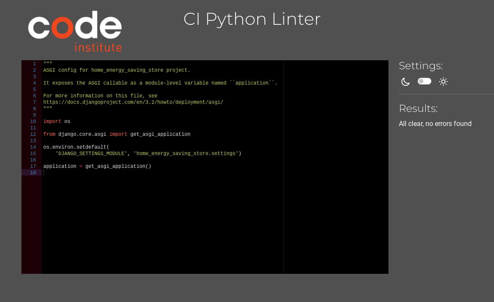
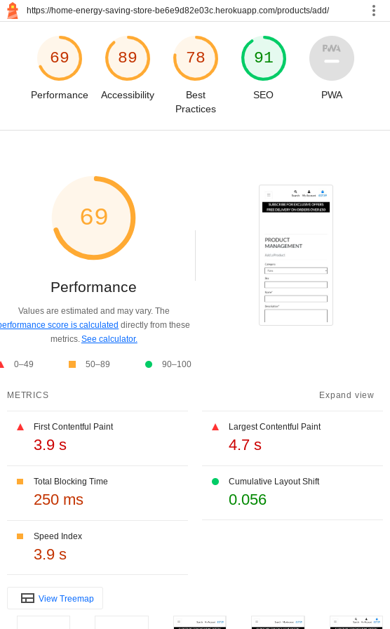
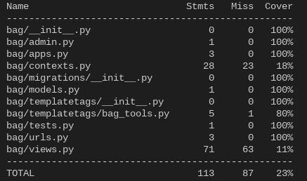

# Testing

> [!NOTE]  
> Return back to the [README.md](README.md) file.

## Code Validation

### HTML

I have used the recommended [HTML W3C Validator](https://validator.w3.org) to validate all of my HTML files.

| Directory | File | Screenshot | Notes |
| --- | --- | --- | --- |
| bag | bag-total.html |  | |
| bag | bag.html |  | Warning: The type attribute is unnecessary for JavaScript resources. Removed type="text/javascript"> from script which resolved the issue|
| bag | checkout-buttons.html |  | |
| bag | product-image.html |  | |
| bag | product-info.html |  | |
| bag | quantity-form.html |  | |
| checkout | checkout.html |  | Pass: No Errors |
| checkout | checkout_success.html |  |Pass: No Errors  |
| contact | contact.html |  | Pass: No Errors |
| faq | faq.html |  | Info: Trailing slash on void elements. Searched all code and couldnt find any trailing slash on faq or other code. but would remove as best practice, although it dosent affect the operation |
| home | index.html |  |Pass: No Errors |
| newsletter | newsletter.html |  |Pass: No Errors |
| products | add_product.html |  | Info: Trailing slash on void elements. Searched all code and couldnt find any trailing slash on faq or other code. but would remove as best practice, although it dosent affect the operation|
| products | custom_clearable_file_input.html |  | |
| products | edit_product.html |  |Info: Trailing slash on void elements. Searched all code and couldnt find any trailing slash on faq or other code. but would remove as best practice, although it dosent affect the operation |
| products | product_detail.html |  | |
| products | products.html |  |Pass: No Errors |
| profiles | profile.html |  | |
| templates | 400.html |  | |
| templates | 403.html |  | |
| templates | 404.html |  | |
| templates | 500.html |  | |
| tips_and_tricks | add_post.html |  | |
| tips_and_tricks | tips_and_tricks.html |  | |
| tips_and_tricks | update_post.html |  | |

### CSS

I have used the recommended [CSS Jigsaw Validator](https://jigsaw.w3.org/css-validator) to validate all of my CSS files.

| Directory | File | Screenshot | Notes |
| --- | --- | --- | --- |
| checkout | checkout.css |  | |
| home | error.css |  | |
| profiles | profile.css |  | |
| static | base.css |  | |

### JavaScript

I have used the recommended [JShint Validator](https://jshint.com) to validate all of my JS files.

I have used /* jshint esversion: 11, jquery: true */ at the top of the file so Jshint is allowed to recognize modern ES6 methods, such as:
`let`.

| File | Screenshot | Notes |
| --- | --- | --- |
| base.js |  | Unused variables from external file|

### Python

I have used the recommended [PEP8 CI Python Linter](https://pep8ci.herokuapp.com) to validate all of my Python files.

For lines that have been too long I have shortened everything where possible however there was one section in settings.py that couldn't be shortened due to it affecting the functionality of the code so I have used `# noqa` at the end of those lines so it will ignore linting validation.

| Directory | File | CI URL | Screenshot | Notes |
| --- | --- | --- | --- | --- |
| bag | admin.py | [PEP8 CI]() | |Not Used|
| bag | apps.py | [PEP8 CI](https://pep8ci.herokuapp.com/https://raw.githubusercontent.com/Pimmz/Home-Energy-Saving-Store/main/bag/apps.py) |   | Pass: No Errors|
| bag | contexts.py | [PEP8 CI](https://pep8ci.herokuapp.com/https://pep8ci.herokuapp.com/https://raw.githubusercontent.com/Pimmz/Home-Energy-Saving-Store/main/bag/contexts.py) |  | Pass: No Errors|
| bag | models.py | [PEP8 CI]() ||Not Used|
| bag | bag_tools.py | [PEP8 CI](https://pep8ci.herokuapp.com/https://pep8ci.herokuapp.com/https://raw.githubusercontent.com/Pimmz/Home-Energy-Saving-Store/main/bag/templatetags/bag_tools.py) |  | Pass: No Errors|
| bag | urls.py | [PEP8 CI](https://pep8ci.herokuapp.com/https://https://raw.githubusercontent.com/Pimmz/Home-Energy-Saving-Store/main/bag/urls.py) |  |Pass: No Errors |
| bag | views.py | [PEP8 CI](https://pep8ci.herokuapp.com/https://raw.githubusercontent.com/Pimmz/Home-Energy-Saving-Store/main/bag/views.py) |  | Pass: No Errors|
| checkout | admin.py | [PEP8 CI](https://pep8ci.herokuapp.com/https://raw.githubusercontent.com/Pimmz/Home-Energy-Saving-Store/main/checkout/admin.py) |  |Pass: No Errors |
| checkout | apps.py | [PEP8 CI](https://pep8ci.herokuapp.com/https://raw.githubusercontent.com/Pimmz/Home-Energy-Saving-Store/main/checkout/apps.py) |  | |Not Used|
| checkout | forms.py | [PEP8 CI](https://pep8ci.herokuapp.com/https://raw.githubusercontent.com/Pimmz/Home-Energy-Saving-Store/main/checkout/forms.py) |  | Pass: No Errors|
| checkout | models.py | [PEP8 CI](https://pep8ci.herokuapp.com/https://raw.githubusercontent.com/Pimmz/Home-Energy-Saving-Store/main/checkout/models.py) |  | Pass: No Errors|
| checkout | signals.py | [PEP8 CI](https://pep8ci.herokuapp.com/https://raw.githubusercontent.com/Pimmz/Home-Energy-Saving-Store/main/checkout/signals.py) |  |Pass: No Errors |
| checkout | urls.py | [PEP8 CI](https://pep8ci.herokuapp.com/https://raw.githubusercontent.com/Pimmz/Home-Energy-Saving-Store/main/checkout/urls.py) |  |Pass: No Errors |
| checkout | views.py | [PEP8 CI](https://pep8ci.herokuapp.com/https://raw.githubusercontent.com/Pimmz/Home-Energy-Saving-Store/main/checkout/views.py) |  | Pass: No Errors|
| checkout | webhook_handler.py | [PEP8 CI](https://pep8ci.herokuapp.com/https://raw.githubusercontent.com/Pimmz/Home-Energy-Saving-Store/main/checkout/webhook_handler.py) |  | Pass: No Errors|
| checkout | webhooks.py | [PEP8 CI](https://pep8ci.herokuapp.com/https://raw.githubusercontent.com/Pimmz/Home-Energy-Saving-Store/main/checkout/webhooks.py) |  | Pass: No Errors|
| contact | admin.py | [PEP8 CI](https://pep8ci.herokuapp.com/https://raw.githubusercontent.com/Pimmz/Home-Energy-Saving-Store/main/contact/admin.py) |  |Pass: No Errors |
| contact | apps.py | [PEP8 CI](https://pep8ci.herokuapp.com/https://raw.githubusercontent.com/Pimmz/Home-Energy-Saving-Store/main/contact/apps.py) |  |Pass: No Errors |
| contact | forms.py | [PEP8 CI](https://pep8ci.herokuapp.com/https://raw.githubusercontent.com/Pimmz/Home-Energy-Saving-Store/main/contact/forms.py) |  |Pass: No Errors |
| contact | models.py | [PEP8 CI](https://pep8ci.herokuapp.com/https://raw.githubusercontent.com/Pimmz/Home-Energy-Saving-Store/main/contact/models.py) |  |Pass: No Errors |
| contact | urls.py | [PEP8 CI](https://pep8ci.herokuapp.com/https://raw.githubusercontent.com/Pimmz/Home-Energy-Saving-Store/main/contact/urls.py) |  |Pass: No Errors |
| contact | views.py | [PEP8 CI](https://pep8ci.herokuapp.com/https://raw.githubusercontent.com/Pimmz/Home-Energy-Saving-Store/main/contact/views.py) |  |Pass: No Errors |
| faq | admin.py | [PEP8 CI] |Not Used|
| faq | apps.py | [PEP8 CI](https://pep8ci.herokuapp.com/https://raw.githubusercontent.com/Pimmz/Home-Energy-Saving-Store/main/faq/apps.py) |  |Pass: No Errors |
| faq | models.py | [PEP8 CI](https://pep8ci.herokuapp.com/https://raw.githubusercontent.com/Pimmz/Home-Energy-Saving-Store/main/faq/models.py) |  |Pass: No Errors |
| faq | urls.py | [PEP8 CI](https://pep8ci.herokuapp.com/https://raw.githubusercontent.com/Pimmz/Home-Energy-Saving-Store/main/faq/urls.py) |  |Pass: No Errors |
| faq | views.py | [PEP8 CI](https://pep8ci.herokuapp.com/https://raw.githubusercontent.com/Pimmz/Home-Energy-Saving-Store/main/faq/views.py) |  |Pass: No Errors |
| home | admin.py | [PEP8 CI] | Not used|
| home | apps.py | [PEP8 CI](https://pep8ci.herokuapp.com/https://raw.githubusercontent.com/Pimmz/Home-Energy-Saving-Store/main/home/apps.py) |  | Pass: No Errors|
| home | models.py | [PEP8 CI] | Not used|
| home | urls.py | [PEP8 CI](https://pep8ci.herokuapp.com/https://raw.githubusercontent.com/Pimmz/Home-Energy-Saving-Store/main/home/urls.py) |  | Pass: No Errors|
| home | views.py | [PEP8 CI](https://pep8ci.herokuapp.com/https://raw.githubusercontent.com/Pimmz/Home-Energy-Saving-Store/main/home/views.py) |  |Pass: No Errors |
| home_energy_saving_store | asgi.py | [PEP8 CI](https://pep8ci.herokuapp.com/https://raw.githubusercontent.com/Pimmz/Home-Energy-Saving-Store/main/home_energy_saving_store/asgi.py) |  |Pass: No Errors |
| home_energy_saving_store | settings.py | [PEP8 CI](https://pep8ci.herokuapp.com/https://raw.githubusercontent.com/Pimmz/Home-Energy-Saving-Store/main/home_energy_saving_store/settings.py) |  | Lines to long but cant be changed so added #noqa|
| home_energy_saving_store | urls.py | [PEP8 CI](https://pep8ci.herokuapp.com/https://raw.githubusercontent.com/Pimmz/Home-Energy-Saving-Store/main/home_energy_saving_store/urls.py) |  | Pass: No Errors|
| home_energy_saving_store | views.py | [PEP8 CI](https://pep8ci.herokuapp.com/https://raw.githubusercontent.com/Pimmz/Home-Energy-Saving-Store/main/home_energy_saving_store/views.py) |  |Pass: No Errors |
| newsletter | admin.py | [PEP8 CI](https://pep8ci.herokuapp.com/https://raw.githubusercontent.com/Pimmz/Home-Energy-Saving-Store/main/newsletter/admin.py) |  |Pass: No Errors |
| newsletter | apps.py | [PEP8 CI](https://pep8ci.herokuapp.com/https://raw.githubusercontent.com/Pimmz/Home-Energy-Saving-Store/main/newsletter/apps.py) |  |Pass: No Errors |
| newsletter | forms.py | [PEP8 CI](https://pep8ci.herokuapp.com/https://raw.githubusercontent.com/Pimmz/Home-Energy-Saving-Store/main/newsletter/forms.py) |  |Pass: No Errors |
| newsletter | models.py | [PEP8 CI](https://pep8ci.herokuapp.com/https://raw.githubusercontent.com/Pimmz/Home-Energy-Saving-Store/main/newsletter/models.py) |  |Pass: No Errors |
| newsletter | urls.py | [PEP8 CI](https://pep8ci.herokuapp.com/https://raw.githubusercontent.com/Pimmz/Home-Energy-Saving-Store/main/newsletter/urls.py) |  |Pass: No Errors |
| newsletter | views.py | [PEP8 CI](https://pep8ci.herokuapp.com/https://raw.githubusercontent.com/Pimmz/Home-Energy-Saving-Store/main/newsletter/views.py) |  |Pass: No Errors |
| products | admin.py | [PEP8 CI](https://pep8ci.herokuapp.com/https://raw.githubusercontent.com/Pimmz/Home-Energy-Saving-Store/main/products/admin.py) |  |Pass: No Errors |
| products | apps.py | [PEP8 CI](https://pep8ci.herokuapp.com/https://raw.githubusercontent.com/Pimmz/Home-Energy-Saving-Store/main/products/apps.py) |  |Pass: No Errors |
| products | forms.py | [PEP8 CI](https://pep8ci.herokuapp.com/https://raw.githubusercontent.com/Pimmz/Home-Energy-Saving-Store/main/products/forms.py) |  |Pass: No Errors |
| products | models.py | [PEP8 CI](https://pep8ci.herokuapp.com/https://raw.githubusercontent.com/Pimmz/Home-Energy-Saving-Store/main/products/models.py) |  |Pass: No Errors |
| products | urls.py | [PEP8 CI](https://pep8ci.herokuapp.com/https://raw.githubusercontent.com/Pimmz/Home-Energy-Saving-Store/main/products/urls.py) |  |Pass: No Errors |
| products | views.py | [PEP8 CI](https://pep8ci.herokuapp.com/https://raw.githubusercontent.com/Pimmz/Home-Energy-Saving-Store/main/products/views.py) |  |Pass: No Errors |
| products | widgets.py | [PEP8 CI](https://pep8ci.herokuapp.com/https://raw.githubusercontent.com/Pimmz/Home-Energy-Saving-Store/main/products/widgets.py) |  |Pass: No Errors |
| profiles | admin.py | [PEP8 CI] |Not Used |
| profiles | apps.py | [PEP8 CI](https://pep8ci.herokuapp.com/https://raw.githubusercontent.com/Pimmz/Home-Energy-Saving-Store/main/profiles/apps.py) |  |Pass: No Errors |
| profiles | forms.py | [PEP8 CI](https://pep8ci.herokuapp.com/https://raw.githubusercontent.com/Pimmz/Home-Energy-Saving-Store/main/profiles/forms.py) |  |Pass: No Errors |
| profiles | models.py | [PEP8 CI](https://pep8ci.herokuapp.com/https://raw.githubusercontent.com/Pimmz/Home-Energy-Saving-Store/main/profiles/models.py) |  |Pass: No Errors |
| profiles | urls.py | [PEP8 CI](https://pep8ci.herokuapp.com/https://raw.githubusercontent.com/Pimmz/Home-Energy-Saving-Store/main/profiles/urls.py) |  |Pass: No Errors |
| profiles | views.py | [PEP8 CI](https://pep8ci.herokuapp.com/https://raw.githubusercontent.com/Pimmz/Home-Energy-Saving-Store/main/profiles/views.py) |  |Pass: No Errors |
| tips_and_tricks | admin.py | [PEP8 CI](https://pep8ci.herokuapp.com/https://raw.githubusercontent.com/Pimmz/Home-Energy-Saving-Store/main/tips_and_tricks/admin.py) |  |Pass: No Errors |
| tips_and_tricks | apps.py | [PEP8 CI](https://pep8ci.herokuapp.com/https://raw.githubusercontent.com/Pimmz/Home-Energy-Saving-Store/main/tips_and_tricks/apps.py) |  |Pass: No Errors |
| tips_and_tricks | forms.py | [PEP8 CI](https://pep8ci.herokuapp.com/https://raw.githubusercontent.com/Pimmz/Home-Energy-Saving-Store/main/tips_and_tricks/forms.py) |  |Pass: No Errors |
| tips_and_tricks | models.py | [PEP8 CI](https://pep8ci.herokuapp.com/https://raw.githubusercontent.com/Pimmz/Home-Energy-Saving-Store/main/tips_and_tricks/models.py) |  |Pass: No Errors |
| tips_and_tricks | urls.py | [PEP8 CI](https://pep8ci.herokuapp.com/https://raw.githubusercontent.com/Pimmz/Home-Energy-Saving-Store/main/tips_and_tricks/urls.py) |  |Pass: No Errors |
| tips_and_tricks | views.py | [PEP8 CI](https://pep8ci.herokuapp.com/https://raw.githubusercontent.com/Pimmz/Home-Energy-Saving-Store/main/tips_and_tricks/views.py) |  |Pass: No Errors |
|  | manage.py | [PEP8 CI](https://pep8ci.herokuapp.com/https://raw.githubusercontent.com/Pimmz/Home-Energy-Saving-Store/main/manage.py) |  |Pass: No Errors |

## Browser Compatibility

I have tested the Home Energy Saving Store on four different browsers using [Browserling](https://www.browserling.com/). I used this site because you can test multiple browsers in one place for free. The first was Chrome, the second was Firefox, the third was Edge and the fourth was Opera.

- [Chrome](https://www.google.com/chrome)
- [Firefox (Developer Edition)](https://www.mozilla.org/firefox/developer)
- [Edge](https://brave.com/download)
- [Opera](https://www.opera.com/download)

I've tested my deployed project on multiple browsers to check for compatibility issues.

| Browser | Screenshot | Notes |
| --- | --- | --- |
| Chrome |  | Works as expected |
| Firefox |  | Works as expected |
| Edge |  | Works as expected |
| Opera |  | Works as expected |

## Responsiveness

I've tested my deployed project on multiple devices to check for responsiveness issues.

| Device | Screenshot | Notes |
| --- | --- | --- |
| ipad mini |  | Works as expected |
| ipad air |  | Works as expected |
| iphonese | | Works as expected |
| iphone 12 pro |  | Works as expected |
| iphone xr |  | Works as expected |
| Nest hub|  | Works as expected |
| Nest hub Max|  | Works as expected |
| Pixel 7 |  | Works as expected |
| Surface duo |  | Works as expected |
| Galaxy A51 / 71 |  | Works as expected |
| Galaxy S8 |  | Works as expected |
| Galaxy S20 Ultra |  | Works as expected |

## Lighthouse Audit

I've tested my deployed project using the Lighthouse Audit tool to check for any major issues. 

Desktop
| Page | Size | Screenshot | Notes |
| --- | --- | --- | --- |
| Home | Desktop |  | Few warnings |
| All Products | Desktop |  | Few warnings |
| Radiator | Desktop |  | Worked as expected |
| Led Lights | Desktop |  | Worked as expected |
| Insulation | Desktop |  | Worked as expected |
| Contact Us | Desktop |  | Worked as expected |
| Newsletter | Desktop |  | Worked as expected |
| Tips and Tricks | Desktop |  | Worked as expected |
| FAQ | Desktop |  | Average performance due to number of images and size |
| Register | Desktop |  | Good overall though average accessibility |
| Product Management | Desktop |  | Worked as expected  |
| Shopping Bag | Desktop |  | Good overall although accessibility |

Mobile
| Page | Size | Screenshot | Notes |
| --- | --- | --- | --- |
| Home | Mobile |  | Slow performance. Compressed and using cloudinary to be more effective. |
| All Products | Mobile |  | Slow performance. Compressed and using cloudinary to be more effective|
| Radiator | Desktop |  |  Average performance. Everything else is operating as expected|
| Contact Us | Desktop |  | Average performance. Everything else is operating as expected|
| Newsletter | Desktop |  | Average performance. Everything else is operating as expected |
| Tips and Tricks | Desktop |  | Slow performance. Compressed and using cloudinary to be more effective |
| FAQ | Desktop |  | Slow performance. Everything else is operating as expected|
| Register| Desktop |  | Slow performance. Compressed and using cloudinary to be more effective |
| Product Maangement | Desktop |  | Average performance. Everything else is operating as expected |
| Shopping Bag | Desktop |  | Slow performance. Compressed and using cloudinary to be more effective |

## Defensive Programming

Defensive programming was manually tested with the below user acceptance testing:

| Page | User Action | Expected Result | Pass/Fail | Comments |
| --- | --- | --- | --- | --- |
| Home Page | | | | |
| | Click on Logo Name | Redirection to Home page | Pass | |
| | Search on search bar | Redirection to chosen product | Pass | |
| | Brute forcing the URL to get to the page for loggin users only  |  User redirected to sign up page | Pass |  |
| All Products Page | | | | |
| | Click on All Products link in navbar | Redirection to All products page | Pass | |
| | Click on image | redirection to larger image of product | Pass | |
| | Change sort by method | Products arranged in the order chosen | Pass | |
| | Brute forcing the URL to get to another user's profile | Redirects user back to own profile | Pass | |
| Radiator Page | | | | |
| | Click on All Products link in navbar | Redirection to All products page | Pass | |
| | Click on image | redirection to larger image of product | Pass | |
| | Change sort by method | Products arranged in the order chosen | Pass | |
| | Brute forcing the URL to get to another user's profile | Redirects user back to own profile | Pass | |
| Led Lights Page | | | | |
| | Click on All Products link in navbar | Redirection to All products page | Pass | |
| | Click on image | redirection to larger image of product | Pass | |
| | Change sort by method | Products arranged in the order chosen | Pass | |
| | Brute forcing the URL to get to another user's profile | Redirects user back to own profile | Pass | |
| Insulation Page | | | | |
| | Click on All Products link in navbar | Redirection to All products page | Pass | |
| | Click on image | redirection to larger image of product | Pass | |
| | Change sort by method | Products arranged in the order chosen | Pass | |
| | Brute forcing the URL to get to another user's profile | Redirects user back to own profile | Pass | |
| Contact us Page | | | | |
| | Enter name | Field will accept freeform text | Pass | |
| | Enter valid email address | Field will only accept email address format | Pass | |
| | Select subject from the drop-down menu | User can only choose from the three available choices| Pass | |
| | Enter message in textarea | Field will accept freeform text | Pass | |
| | No message in textareas | error message appears stating this field is required | Pass | |
| | Click the Submit button | Message pops up informing them their message as been successful | Pass |  |
| | Click on the Cancel button | User will be redirected to the Home page  | Pass | |
| Newsletter Page | | | | |
| | Enter valid email address | Field will only accept email address format | Pass | |
| | If the user has already registered their email a message will come up saying so and highlighted in red.| |
| | Click the Submit button | Send the email and displays a message saying it was successful | Pass |  |
| | Click on the Cancel button | User will be redirected to the Home page  | Pass | |
| | Brute forcing the URL to get to another user's profile | User will not be allowed access | Pass | Redirects user back to own profile |
| Tips and Tricks Page | | | | |
| | Click on the Add tip or trick button | Redirection to Add tip and trick page | Pass | |
| | Enter Title | Field will accept freeform text | Pass | |
| | Enter Content | Field will accept freeform text | Pass | |
| | Click on Choose Image button |  Choose your image you want to upload| Pass | |
| | Click the Submit button | Redirects user to the tips and tricks page  | Pass |  |
| | Click on edit button | User will be redirected to the update post page | Pass | |
| | Click the Delete button | Redirects user to tips and tricks  | Pass | checks if its ok to delete |
| | Brute forcing the URL to get to another user's profile | Redirects user back to own profile | Pass | |
| FAQ Page | | | | |
| | Click frequently asked questions | directed to the FAQ page | Pass | |
| | Brute forcing the URL to get to another user's profile | Redirects user back to own profile | Pass | |
| Register Page | | | | |
| | Click on the register Button | Redirection to register page | Pass | |
| | Enter valid email address | Field will only accept email address format | Pass | |
| | password | Field will only accept valid password format | Pass | |
| | Click the sign up button | Redirects user to the home page  | Pass |  |
| | Click on the back to login button | User will be redirected to the login page  | Pass | |
| | Brute forcing the URL to get to another user's profile | Redirects user back to own profile | Pass | |
| Product Management Page | | | | |
| | Select category from the drop-down menu | User can only choose from the seven available choices| Pass | |
| | Enter Content | Field will accept freeform text | Pass | |
| | Click on Choose Image button |  Choose your image you want to upload| Pass | |
| | Click on the Add product Button | Redirection to products page | Pass | |
| | Click on the Cancel button | User will be redirected to the products page  | Pass | |
| | Brute forcing the URL to get to another user's profile | Redirects user back to own profile | Pass | |
| Shopping Bag Page | | | | |
| | Click on the qty button | changes the quantity of the item purchased | Pass | Confirms delete first|
| | Click on update button | updates the qty of the item the user has changed | Pass | |
| | Click the remove button | removes the product selected | Pass | |
| | Click on the keep shopping button | User will be redirected to the prod page  | Pass | |
| | Click on the secure checkout button | User will be redirected to the checkout page  | Pass | |
| | Brute forcing the URL to get to another user's profile | Redirects user back to own profile | Pass | |
| Log Out | | | | |
| | Click sign out button | Redirects user to sign out page | Pass | Confirms logout first |
| | Click on the Cancel button | User will be redirected to the home page  | Pass | |

## User Story Testing

| User Story | Screenshot |
| --- | --- |
|EPIC Viewing and Navigation |
| As a shopper I can contact the store so that I can make a query about something or return a product |  |
| As a Shopper I can view tips and tricks so that I can learn from other user what they have done to save money on my heating and electricity costs |  |
| As a Shopper I can find the store on Facebook so that I can easily find it and trust its authenticity |  |
| As a Shopper I can easily view the total of my purchases at any time so that I can avoid spending too much |  |
| As a Shopper I can view individual products details so that I can identify the price, description, product rating, product image and available sizes |  |
| As a Shopper I can view a specific category of products so that I can quickly find products I'm interested in without having to search through all the products |  |
| As a shopper I can view a list of products so that I can select some to purchase |  |
| EPIC Registration and User Accounts |
### As a Site user I can have a personalised user profile so that I can view my personal order history and order confirmations and save my payment information |  |
| As a Shopper I can Subscribe to to get exclusive offers and News so that I can stay upto date with new and exciting energy saving products as well as exclusive offers and discounts |  |
### As a Site user I can receive an email confirmation after registering so that I can verify that my account registration was successful |  |
| As a Shopper I can Easily recover my password in case I forget it so that I can recover access to my account |  |
| As a Site User I can easily login or log out so that I can access my personal account information |  |
| As a Site user I can easily register for an account so that I can have a personal account and be able to view my profile |  |
| EPIC | Sorting and Searching |
| As a Shopper I can Search for a product by name or description so that I can find a specific product I'd like to purchase |  |
| As a Shopper I can sort multiple categories of products simultaneously so that I can find the best price or best rated products across a broad categories |  |
| As a Shopper I can sort a specific category of product so that I can find the best priced or best rated product in a specific category or sort the product in that 	 
category by name |  |
| As a Shopper I can sort the list of available products so that I can easily identify the best rated best priced and categorically sorted products |  |
| EPIC Purchasing and Checkout |
### As a Shopper I can receive an email confirmation after checking out so that I can keep the confirmation of what I've purchased for my record |  |
### As a Shopper I can view an order confirmation after checkout so that I can verify that I haven't made any mistakes |  |
### As a Shopper I can Feel my personal and payment information is safe and secure so that I can confidently provide the needed information to make a purchase |  |
| As a Shopper I can easily enter my payment information so that I can check out quickly and with no hassles |  |
| As a Shopper I can Adjust the quantity of individual items in my bag so that I can easily make changes to my purchase before checkout |  |
| As a Shopper I can view items in my bag to be purchased so that I can identify the total cost of my purchase and all items I will receive |  |
| As a Shopper I can easily select the quantity of a product when purchasing it so that I can ensure I don't accidentally select the wrong product quantity |  |
| EPIC Admin and Store Management |
|As a Store Owner I can delete a product so that I can remove items that are no longer for sale |  |
| As a Store Owner I can edit/ update a product so that I can change product prices descriptions images and other product criteria |  |
| As a Store Owner I can add a product so that I can add new items to my store |  |

## Automated Testing

I have conducted a series of automated tests on my application.

I fully acknowledge and understand that, in a real-world scenario, an extensive set of additional tests would be more comprehensive.

### JavaScript (Jest Testing)

Due to only having 5 lines of javascript used as a timeout method for the pop up messages I was unable to test it with jest. If I had more javascript I would have used the [jestspyon method](https://jestjs.io/docs/jest-object#jestspyonobject-methodname)

Although I have completed a manual test with a screen shot so you can see the pop up message that will then disappear in 4 secounds.

### Python (Unit Testing)

I have used Django's built-in unit testing framework to test the application functionality.

In order to run the tests, I ran the following command in the terminal each time:

`python3 manage.py test name-of-app `

To create the coverage report, I would then run the following commands:

`coverage run --source=name-of-app manage.py test`

`coverage report`

To see the HTML version of the reports, and find out whether some pieces of code were missing, I ran the following commands:

`coverage html`

`python3 -m http.server`

Below are the results from the various apps on my application that I've tested:

| App | File | Coverage | Screenshot |
| --- | --- | --- | --- |
| Bag | test_forms.py | 99% |  |
| Bag | test_models.py | 100% |  |
| Bag | test_urls.py | 100% |  |
| Bag | test_views.py | 11% |  |
| Checkout | test_forms.py | 39% |  |
| Checkout | test_models.py | 71% |  |
| Checkout | test_urls.py | 100% |  |
| Checkout | test_views.py | 21% |  |
| Home | test_forms.py | 100% |  |
| Home | test_models.py | 100% |  |
| Home | test_urls.py | 100% |  |
| Home | test_views.py | 75% |  |
| Products | test_forms.py | 60% |  |
| Products | test_models.py | 86% |  |
| Products | test_urls.py | 100% |  |
| Products | test_views.py | 17% |  | 
| Profiles | test_forms.py | 39% |  |
| Profiles | test_models.py | 81% |  |
| Profiles | test_urls.py | 100% |  |
| Profiles | test_views.py | 29% |  |
| x | x | x | repeat for all remaining tested apps/files |

## Bugs

- Page not found, error 404

    

  - I fixed this, by ensuring the path was correct in the url.

- Invalid cloudinary url scheme

    

  - To fix this, I corrected the url to 'cloudinary://'

- Rehome not defined

    

  - To fix this, I imported rehome in the views as I had forgotten to put it in.

- Python `E501 line too long` (90 > 79 characters)

    

  - To fix this, I split the line onto two lines ensuring it was split so it would nt cause any errors  

> [!NOTE]  
> There are no remaining bugs that I am aware of.
