# Testing

> [!NOTE]  
> Return back to the [README.md](README.md) file.

🛑🛑🛑🛑🛑🛑🛑🛑🛑🛑-START OF NOTES (to be deleted)

In this section, you need to convince the assessors that you have conducted enough testing to legitimately believe that the site works well.
Essentially, in this part, you should go over all of your project's features, and ensure that they all work as intended,
with the project providing an easy and straightforward way for the users to achieve their goals.

Feature-by-Feature Testing:

Go through each feature of your portfolio site and detail the testing process for each.

Explain the functionality and demonstrate how it aligns with the intended purpose. This could include:

- Navigation: Ensuring smooth transitions between pages, links directing to the correct destinations.
- Responsive Design: Checking for compatibility across various devices and screen sizes.
- Portfolio Display: Verifying that projects are properly showcased with accurate descriptions, images, and links.
- Contact Form: Testing the form submission process, ensuring the user receives a confirmation, and you receive the message.

User Experience Testing:

- Usability Testing: Have users (or simulated users) interact with the site and provide feedback. Document any issues encountered and the resolutions implemented.
- Accessibility Testing: Confirm compliance with accessibility standards (e.g., screen reader compatibility, proper alt text for images, keyboard navigation).

Compatibility Testing:

- Browser Compatibility: Testing on different browsers (Chrome, Firefox, Safari, Edge, etc.) to ensure consistent performance.
- Device Compatibility: Ensuring functionality across various devices (desktops, laptops, tablets, and mobile phones).
- Performance Testing (optional):
	- Speed and Load Testing: Tools like PageSpeed Insights or GTmetrix to check page load times and optimize where necessary.
	- Scalability Testing: Assess how the site handles increased traffic or usage.

Regression Testing:

After implementing fixes or updates, ensure that previous features and functionalities still work as intended. This prevents new changes from breaking existing features.

Documentation and Logs:

Maintain records of testing procedures, results, and any bugs encountered along with their resolutions. This helps demonstrate a systematic approach to testing and problem-solving.
User Feedback Incorporation:

If applicable, mention how user feedback has been taken into account and implemented to enhance the user experience.

🛑🛑🛑🛑🛑🛑🛑🛑🛑🛑-END OF NOTES (to be deleted)

## Code Validation

### HTML

I have used the recommended [HTML W3C Validator](https://validator.w3.org) to validate all of my HTML files.

| Directory | File | Screenshot | Notes |
| --- | --- | --- | --- |
| bag | bag-total.html |  | |
| bag | bag.html |  | |
| bag | checkout-buttons.html |  | |
| bag | product-image.html |  | |
| bag | product-info.html |  | |
| bag | quantity-form.html |  | |
| checkout | checkout.html |  | |
| checkout | checkout_success.html |  | |
| contact | contact.html |  | |
| faq | faq.html |  | |
| home | index.html |  | |
| newsletter | newsletter.html |  | |
| products | add_product.html |  | |
| products | custom_clearable_file_input.html |  | |
| products | edit_product.html |  | |
| products | product_detail.html |  | |
| products | products.html |  | |
| profiles | profile.html |  | |
| templates | 400.html |  | |
| templates | 403.html |  | |
| templates | 404.html |  | |
| templates | 500.html |  | |
| tips_and_tricks | add_post.html |  | |
| tips_and_tricks | tips_and_tricks.html |  | |
| tips_and_tricks | update_post.html |  | |

### CSS

I have used the recommended [CSS Jigsaw Validator](https://jigsaw.w3.org/css-validator) to validate all of my CSS files.

| Directory | File | Screenshot | Notes |
| --- | --- | --- | --- |
| checkout | checkout.css |  | |
| home | error.css |  | |
| profiles | profile.css |  | |
| static | base.css |  | |

### JavaScript

I have used the recommended [JShint Validator](https://jshint.com) to validate all of my JS files.

I have used /* jshint esversion: 11, jquery: true */ at the top of the file so Jshint is allowed to recognize modern ES6 methods, such as:
`let`.

| File | Screenshot | Notes |
| --- | --- | --- |
| base.js |  | Unused variables from external file|


### Python

I have used the recommended [PEP8 CI Python Linter](https://pep8ci.herokuapp.com) to validate all of my Python files.

For lines that have been too long I have shortened everything where possible however there was one section in settings.py that couldn't be shortened due to it affecting the functionality of the code so I have used `# noqa` at the end of those lines so it will ignore linting validation.


| Directory | File | CI URL | Screenshot | Notes |
| --- | --- | --- | --- | --- |
| bag | admin.py | [PEP8 CI]() | |Not Used|
| bag | apps.py | [PEP8 CI](https://pep8ci.herokuapp.com/https://raw.githubusercontent.com/Pimmz/Home-Energy-Saving-Store/main/bag/apps.py) | 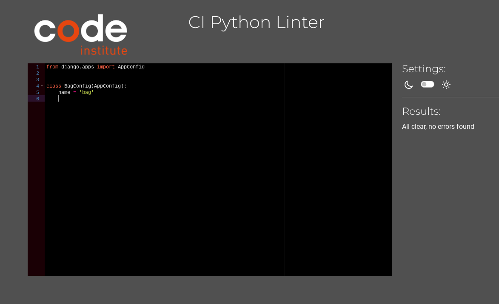  | Pass: No Errors|
| bag | contexts.py | [PEP8 CI](https://pep8ci.herokuapp.com/https://pep8ci.herokuapp.com/https://raw.githubusercontent.com/Pimmz/Home-Energy-Saving-Store/main/bag/contexts.py) |  | Pass: No Errors|
| bag | models.py | [PEP8 CI]() ||Not Used|
| bag | bag_tools.py | [PEP8 CI](https://pep8ci.herokuapp.com/https://pep8ci.herokuapp.com/https://raw.githubusercontent.com/Pimmz/Home-Energy-Saving-Store/main/bag/templatetags/bag_tools.py) | 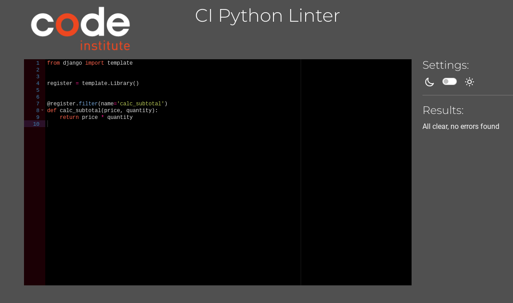 | Pass: No Errors|
| bag | urls.py | [PEP8 CI](https://pep8ci.herokuapp.com/https://https://raw.githubusercontent.com/Pimmz/Home-Energy-Saving-Store/main/bag/urls.py) |  |Pass: No Errors |
| bag | views.py | [PEP8 CI](https://pep8ci.herokuapp.com/https://raw.githubusercontent.com/Pimmz/Home-Energy-Saving-Store/main/bag/views.py) | 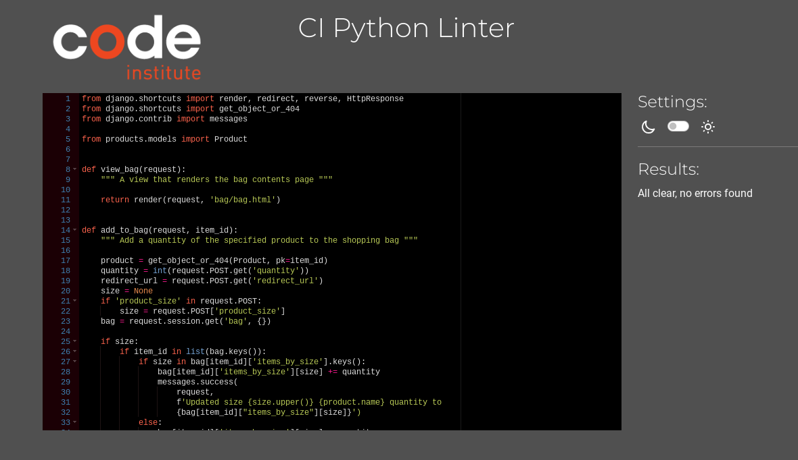 | Pass: No Errors|
| checkout | admin.py | [PEP8 CI](https://pep8ci.herokuapp.com/https://raw.githubusercontent.com/Pimmz/Home-Energy-Saving-Store/main/checkout/admin.py) | 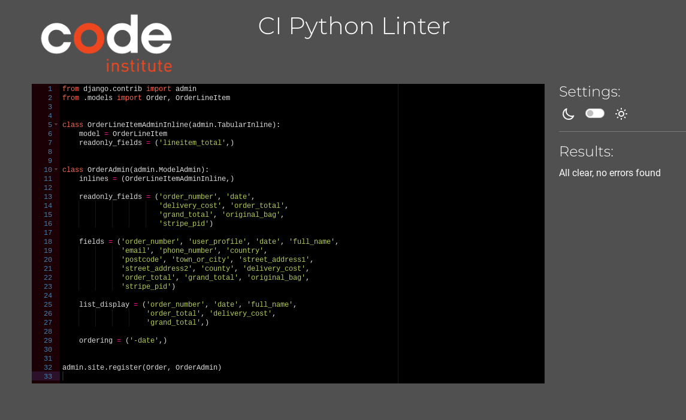 |Pass: No Errors |
| checkout | apps.py | [PEP8 CI](https://pep8ci.herokuapp.com/https://raw.githubusercontent.com/Pimmz/Home-Energy-Saving-Store/main/checkout/apps.py) | 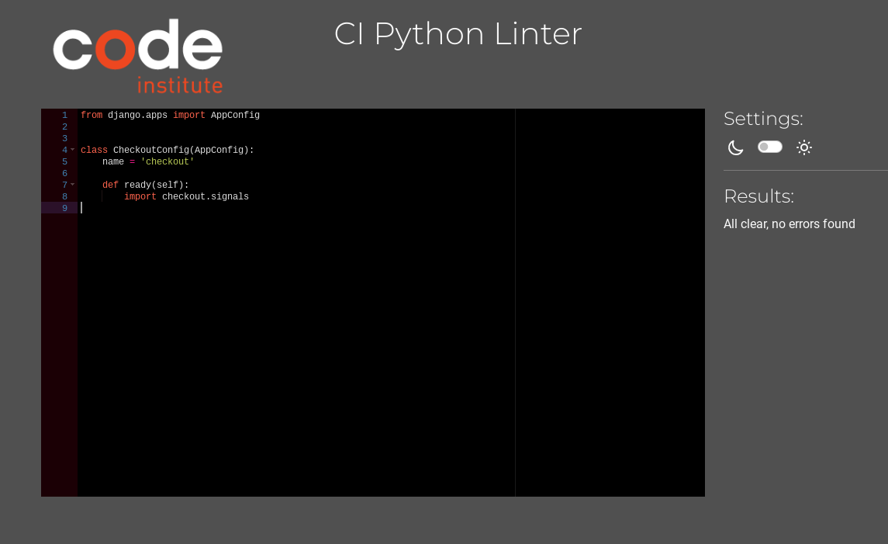 | |Not Used|
| checkout | forms.py | [PEP8 CI](https://pep8ci.herokuapp.com/https://raw.githubusercontent.com/Pimmz/Home-Energy-Saving-Store/main/checkout/forms.py) |  | Pass: No Errors|
| checkout | models.py | [PEP8 CI](https://pep8ci.herokuapp.com/https://raw.githubusercontent.com/Pimmz/Home-Energy-Saving-Store/main/checkout/models.py) |  | Pass: No Errors|
| checkout | signals.py | [PEP8 CI](https://pep8ci.herokuapp.com/https://raw.githubusercontent.com/Pimmz/Home-Energy-Saving-Store/main/checkout/signals.py) | 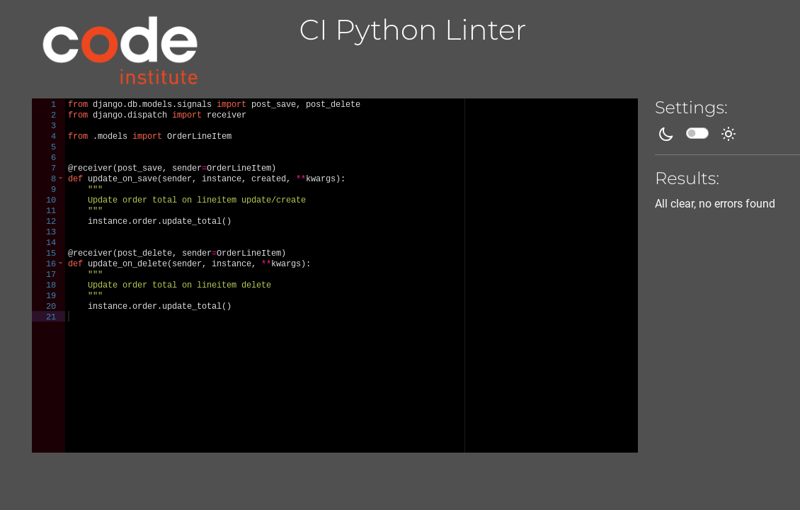 |Pass: No Errors |
| checkout | urls.py | [PEP8 CI](https://pep8ci.herokuapp.com/https://raw.githubusercontent.com/Pimmz/Home-Energy-Saving-Store/main/checkout/urls.py) |  |Pass: No Errors |
| checkout | views.py | [PEP8 CI](https://pep8ci.herokuapp.com/https://raw.githubusercontent.com/Pimmz/Home-Energy-Saving-Store/main/checkout/views.py) |  | Pass: No Errors|
| checkout | webhook_handler.py | [PEP8 CI](https://pep8ci.herokuapp.com/https://raw.githubusercontent.com/Pimmz/Home-Energy-Saving-Store/main/checkout/webhook_handler.py) | 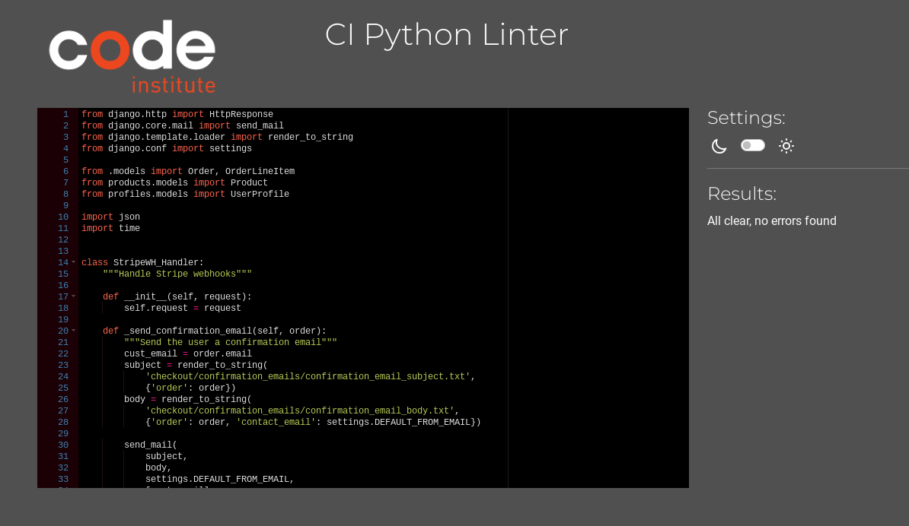 | Pass: No Errors|
| checkout | webhooks.py | [PEP8 CI](https://pep8ci.herokuapp.com/https://raw.githubusercontent.com/Pimmz/Home-Energy-Saving-Store/main/checkout/webhooks.py) | 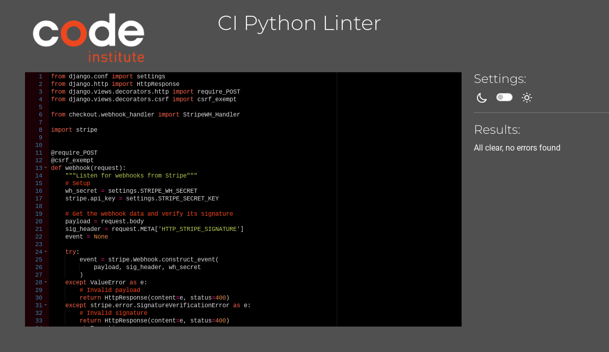 | Pass: No Errors|
| contact | admin.py | [PEP8 CI](https://pep8ci.herokuapp.com/https://raw.githubusercontent.com/Pimmz/Home-Energy-Saving-Store/main/contact/admin.py) |  |Pass: No Errors |
| contact | apps.py | [PEP8 CI](https://pep8ci.herokuapp.com/https://raw.githubusercontent.com/Pimmz/Home-Energy-Saving-Store/main/contact/apps.py) |  |Pass: No Errors |
| contact | forms.py | [PEP8 CI](https://pep8ci.herokuapp.com/https://raw.githubusercontent.com/Pimmz/Home-Energy-Saving-Store/main/contact/forms.py) |  |Pass: No Errors |
| contact | models.py | [PEP8 CI](https://pep8ci.herokuapp.com/https://raw.githubusercontent.com/Pimmz/Home-Energy-Saving-Store/main/contact/models.py) |  |Pass: No Errors |
| contact | urls.py | [PEP8 CI](https://pep8ci.herokuapp.com/https://raw.githubusercontent.com/Pimmz/Home-Energy-Saving-Store/main/contact/urls.py) |  |Pass: No Errors |
| contact | views.py | [PEP8 CI](https://pep8ci.herokuapp.com/https://raw.githubusercontent.com/Pimmz/Home-Energy-Saving-Store/main/contact/views.py) | 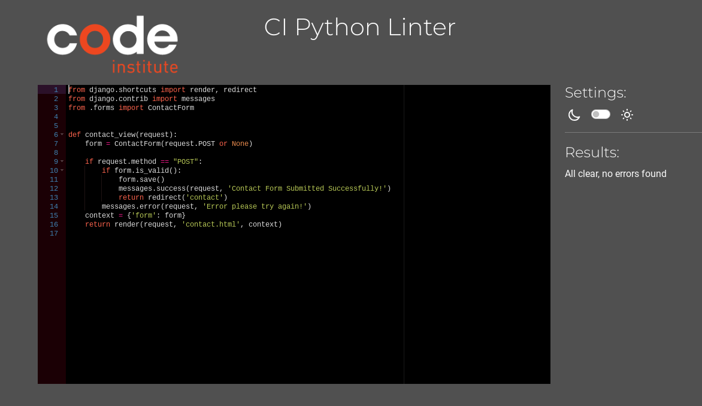 |Pass: No Errors |
| faq | admin.py | [PEP8 CI] |Not Used|
| faq | apps.py | [PEP8 CI](https://pep8ci.herokuapp.com/https://raw.githubusercontent.com/Pimmz/Home-Energy-Saving-Store/main/faq/apps.py) | 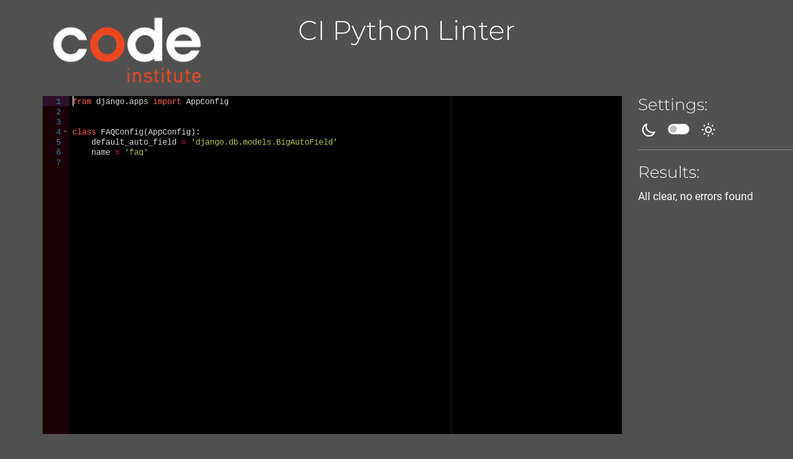 |Pass: No Errors |
| faq | models.py | [PEP8 CI](https://pep8ci.herokuapp.com/https://raw.githubusercontent.com/Pimmz/Home-Energy-Saving-Store/main/faq/models.py) |  |Pass: No Errors |
| faq | urls.py | [PEP8 CI](https://pep8ci.herokuapp.com/https://raw.githubusercontent.com/Pimmz/Home-Energy-Saving-Store/main/faq/urls.py) | 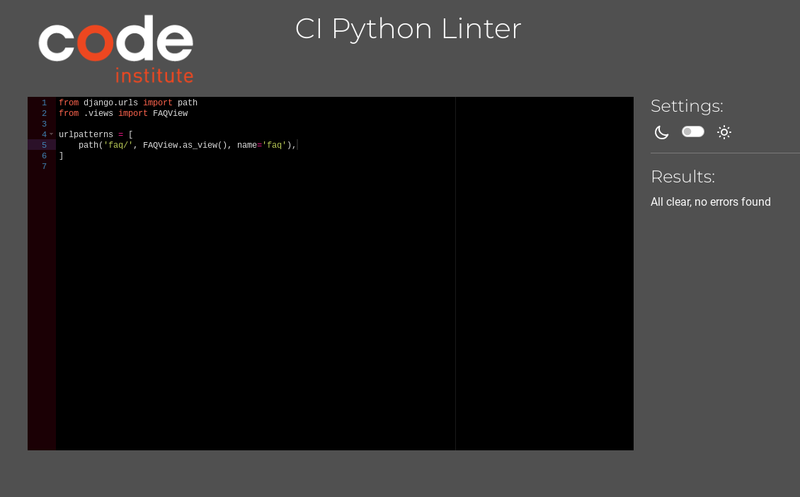 |Pass: No Errors |
| faq | views.py | [PEP8 CI](https://pep8ci.herokuapp.com/https://raw.githubusercontent.com/Pimmz/Home-Energy-Saving-Store/main/faq/views.py) | 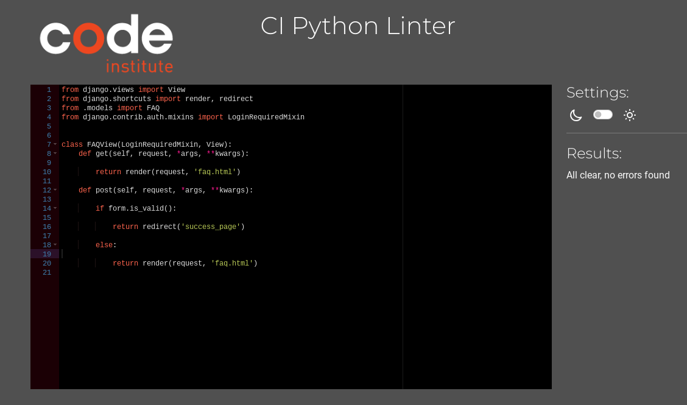 |Pass: No Errors |
| home | admin.py | [PEP8 CI] | Not used|
| home | apps.py | [PEP8 CI](https://pep8ci.herokuapp.com/https://raw.githubusercontent.com/Pimmz/Home-Energy-Saving-Store/main/home/apps.py) | 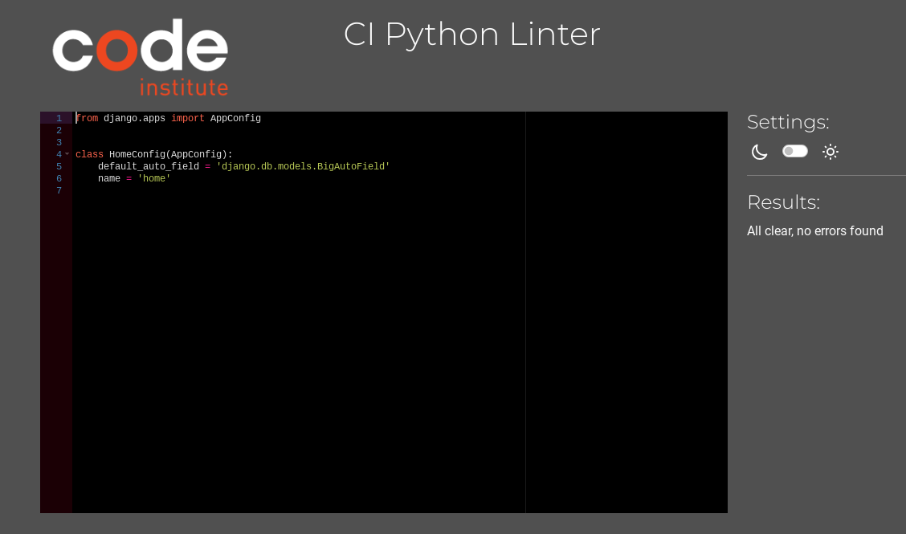 | Pass: No Errors|
| home | models.py | [PEP8 CI] | Not used|
| home | urls.py | [PEP8 CI](https://pep8ci.herokuapp.com/https://raw.githubusercontent.com/Pimmz/Home-Energy-Saving-Store/main/home/urls.py) |  | Pass: No Errors|
| home | views.py | [PEP8 CI](https://pep8ci.herokuapp.com/https://raw.githubusercontent.com/Pimmz/Home-Energy-Saving-Store/main/home/views.py) |  |Pass: No Errors |
| home_energy_saving_store | asgi.py | [PEP8 CI](https://pep8ci.herokuapp.com/https://raw.githubusercontent.com/Pimmz/Home-Energy-Saving-Store/main/home_energy_saving_store/asgi.py) |  |Pass: No Errors |
| home_energy_saving_store | settings.py | [PEP8 CI](https://pep8ci.herokuapp.com/https://raw.githubusercontent.com/Pimmz/Home-Energy-Saving-Store/main/home_energy_saving_store/settings.py) | 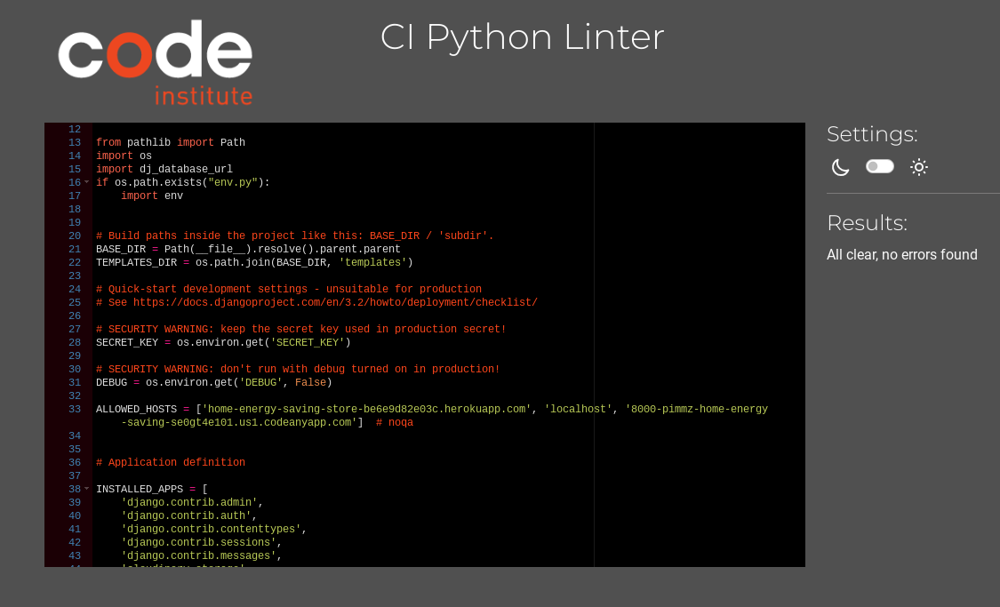 | Lines to long but cant be changed so added #noqa|
| home_energy_saving_store | urls.py | [PEP8 CI](https://pep8ci.herokuapp.com/https://raw.githubusercontent.com/Pimmz/Home-Energy-Saving-Store/main/home_energy_saving_store/urls.py) | 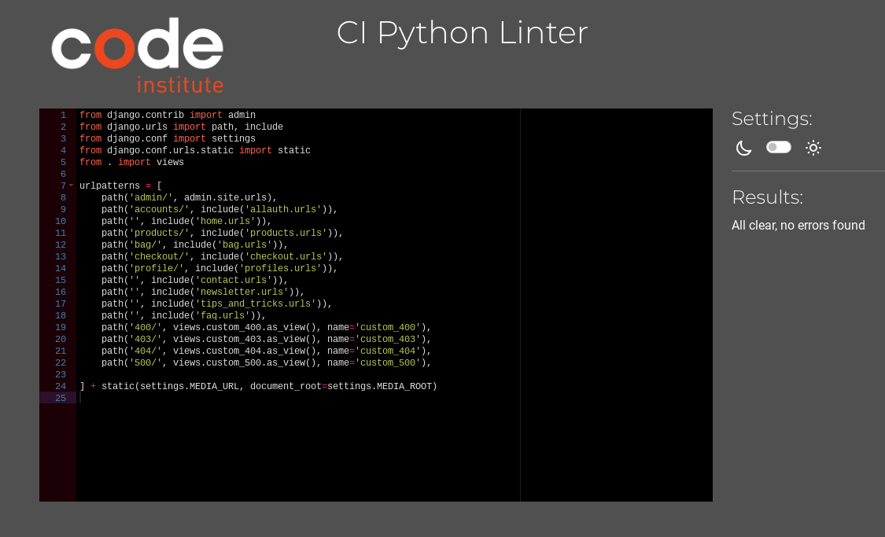 | Pass: No Errors|
| home_energy_saving_store | views.py | [PEP8 CI](https://pep8ci.herokuapp.com/https://raw.githubusercontent.com/Pimmz/Home-Energy-Saving-Store/main/home_energy_saving_store/views.py) |  |Pass: No Errors |
| newsletter | admin.py | [PEP8 CI](https://pep8ci.herokuapp.com/https://raw.githubusercontent.com/Pimmz/Home-Energy-Saving-Store/main/newsletter/admin.py) | 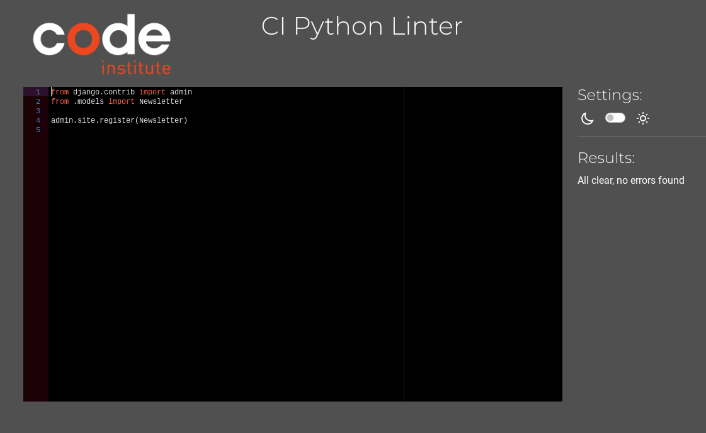 |Pass: No Errors |
| newsletter | apps.py | [PEP8 CI](https://pep8ci.herokuapp.com/https://raw.githubusercontent.com/Pimmz/Home-Energy-Saving-Store/main/newsletter/apps.py) | 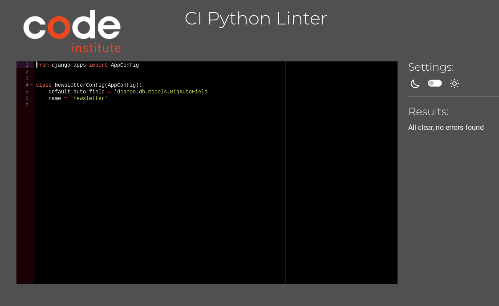 |Pass: No Errors |
| newsletter | forms.py | [PEP8 CI](https://pep8ci.herokuapp.com/https://raw.githubusercontent.com/Pimmz/Home-Energy-Saving-Store/main/newsletter/forms.py) |  |Pass: No Errors |
| newsletter | models.py | [PEP8 CI](https://pep8ci.herokuapp.com/https://raw.githubusercontent.com/Pimmz/Home-Energy-Saving-Store/main/newsletter/models.py) | 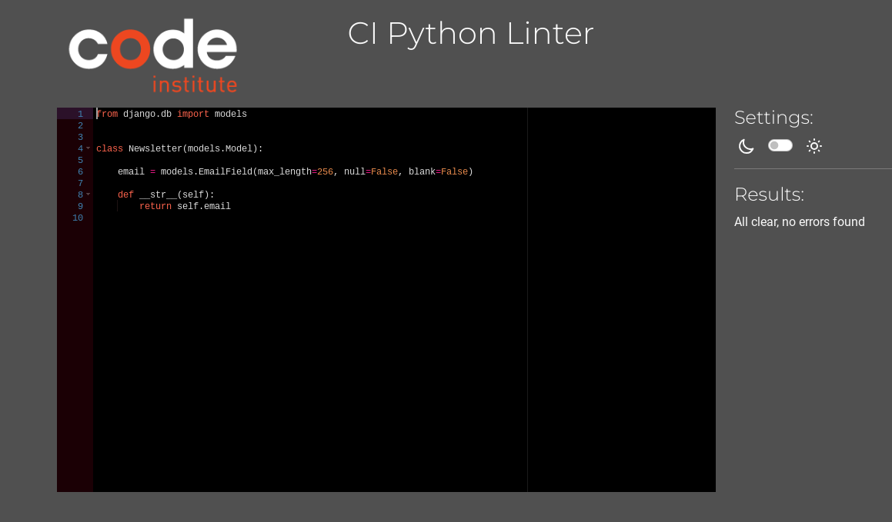 |Pass: No Errors |
| newsletter | urls.py | [PEP8 CI](https://pep8ci.herokuapp.com/https://raw.githubusercontent.com/Pimmz/Home-Energy-Saving-Store/main/newsletter/urls.py) |  |Pass: No Errors |
| newsletter | views.py | [PEP8 CI](https://pep8ci.herokuapp.com/https://raw.githubusercontent.com/Pimmz/Home-Energy-Saving-Store/main/newsletter/views.py) |  |Pass: No Errors |
| products | admin.py | [PEP8 CI](https://pep8ci.herokuapp.com/https://raw.githubusercontent.com/Pimmz/Home-Energy-Saving-Store/main/products/admin.py) |  |Pass: No Errors |
| products | apps.py | [PEP8 CI](https://pep8ci.herokuapp.com/https://raw.githubusercontent.com/Pimmz/Home-Energy-Saving-Store/main/products/apps.py) | 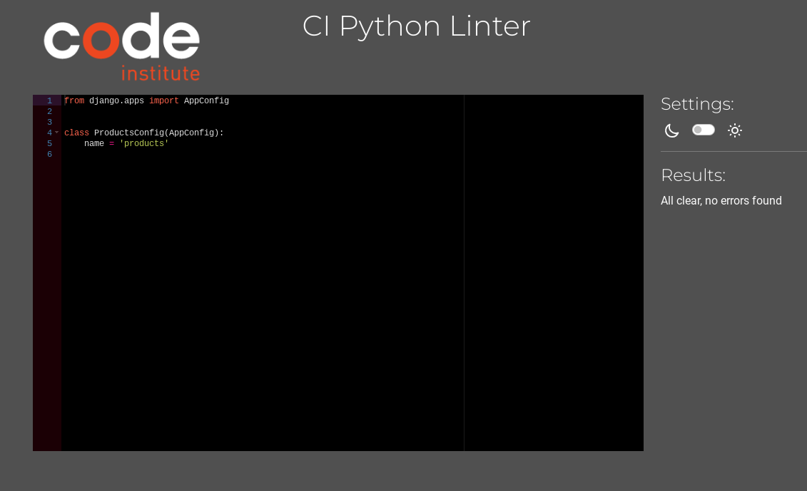 |Pass: No Errors |
| products | forms.py | [PEP8 CI](https://pep8ci.herokuapp.com/https://raw.githubusercontent.com/Pimmz/Home-Energy-Saving-Store/main/products/forms.py) | 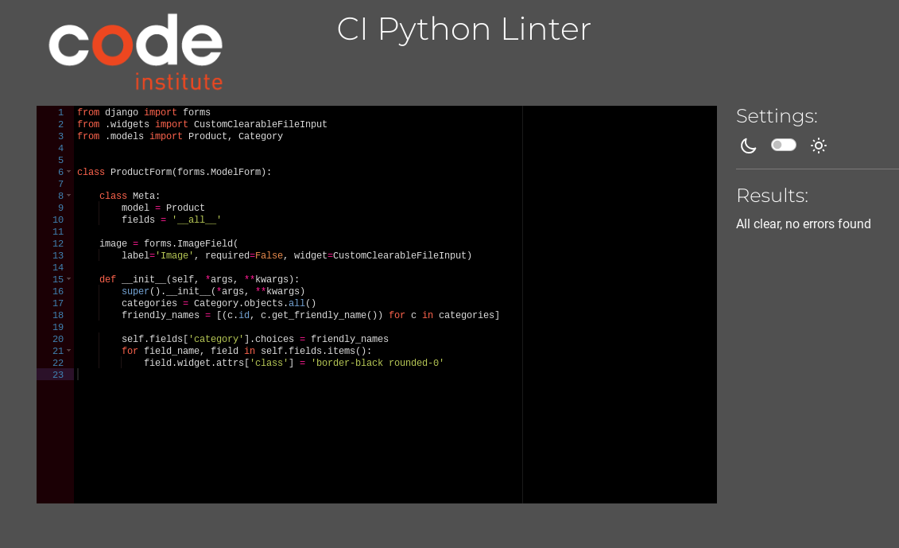 |Pass: No Errors |
| products | models.py | [PEP8 CI](https://pep8ci.herokuapp.com/https://raw.githubusercontent.com/Pimmz/Home-Energy-Saving-Store/main/products/models.py) |  |Pass: No Errors |
| products | urls.py | [PEP8 CI](https://pep8ci.herokuapp.com/https://raw.githubusercontent.com/Pimmz/Home-Energy-Saving-Store/main/products/urls.py) |  |Pass: No Errors |
| products | views.py | [PEP8 CI](https://pep8ci.herokuapp.com/https://raw.githubusercontent.com/Pimmz/Home-Energy-Saving-Store/main/products/views.py) | 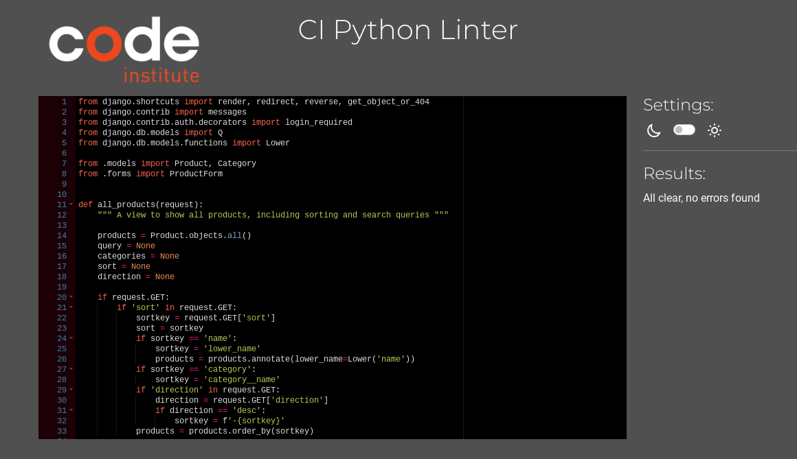 |Pass: No Errors |
| products | widgets.py | [PEP8 CI](https://pep8ci.herokuapp.com/https://raw.githubusercontent.com/Pimmz/Home-Energy-Saving-Store/main/products/widgets.py) |  |Pass: No Errors |
| profiles | admin.py | [PEP8 CI] |Not Used |
| profiles | apps.py | [PEP8 CI](https://pep8ci.herokuapp.com/https://raw.githubusercontent.com/Pimmz/Home-Energy-Saving-Store/main/profiles/apps.py) |  |Pass: No Errors |
| profiles | forms.py | [PEP8 CI](https://pep8ci.herokuapp.com/https://raw.githubusercontent.com/Pimmz/Home-Energy-Saving-Store/main/profiles/forms.py) |  |Pass: No Errors |
| profiles | models.py | [PEP8 CI](https://pep8ci.herokuapp.com/https://raw.githubusercontent.com/Pimmz/Home-Energy-Saving-Store/main/profiles/models.py) | 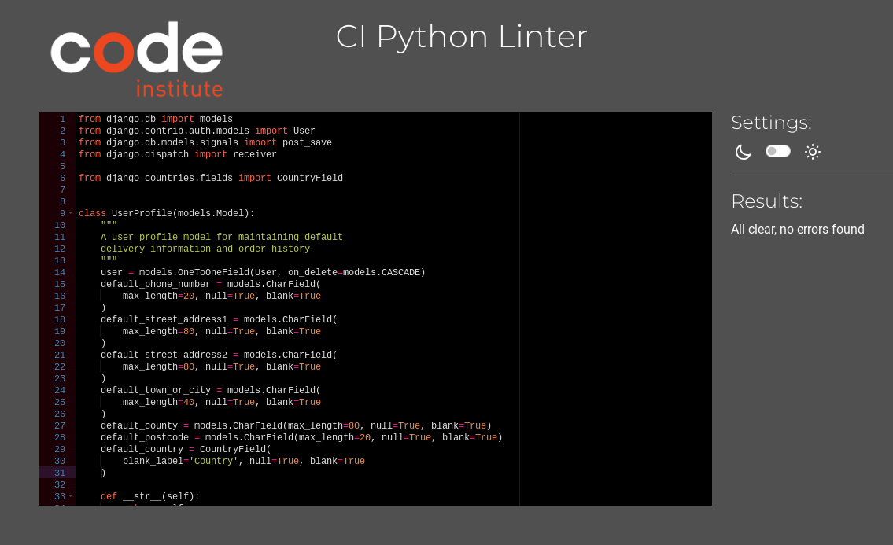 |Pass: No Errors |
| profiles | urls.py | [PEP8 CI](https://pep8ci.herokuapp.com/https://raw.githubusercontent.com/Pimmz/Home-Energy-Saving-Store/main/profiles/urls.py) | 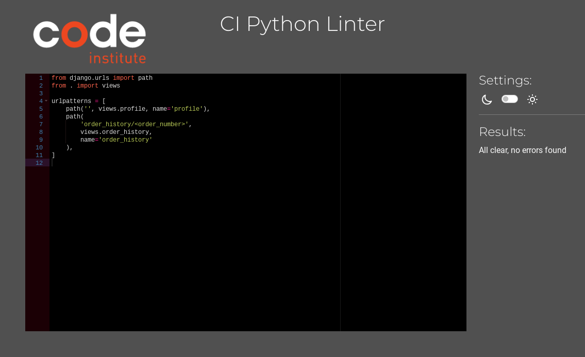 |Pass: No Errors |
| profiles | views.py | [PEP8 CI](https://pep8ci.herokuapp.com/https://raw.githubusercontent.com/Pimmz/Home-Energy-Saving-Store/main/profiles/views.py) |  |Pass: No Errors |
| tips_and_tricks | admin.py | [PEP8 CI](https://pep8ci.herokuapp.com/https://raw.githubusercontent.com/Pimmz/Home-Energy-Saving-Store/main/tips_and_tricks/admin.py) |  |Pass: No Errors |
| tips_and_tricks | apps.py | [PEP8 CI](https://pep8ci.herokuapp.com/https://raw.githubusercontent.com/Pimmz/Home-Energy-Saving-Store/main/tips_and_tricks/apps.py) | 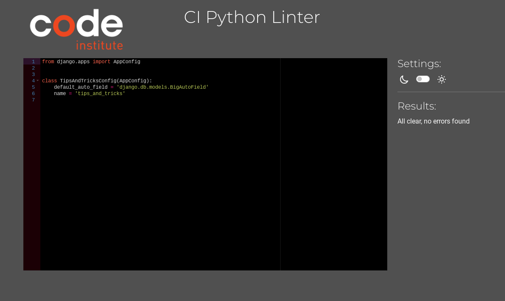 |Pass: No Errors |
| tips_and_tricks | forms.py | [PEP8 CI](https://pep8ci.herokuapp.com/https://raw.githubusercontent.com/Pimmz/Home-Energy-Saving-Store/main/tips_and_tricks/forms.py) |  |Pass: No Errors |
| tips_and_tricks | models.py | [PEP8 CI](https://pep8ci.herokuapp.com/https://raw.githubusercontent.com/Pimmz/Home-Energy-Saving-Store/main/tips_and_tricks/models.py) | 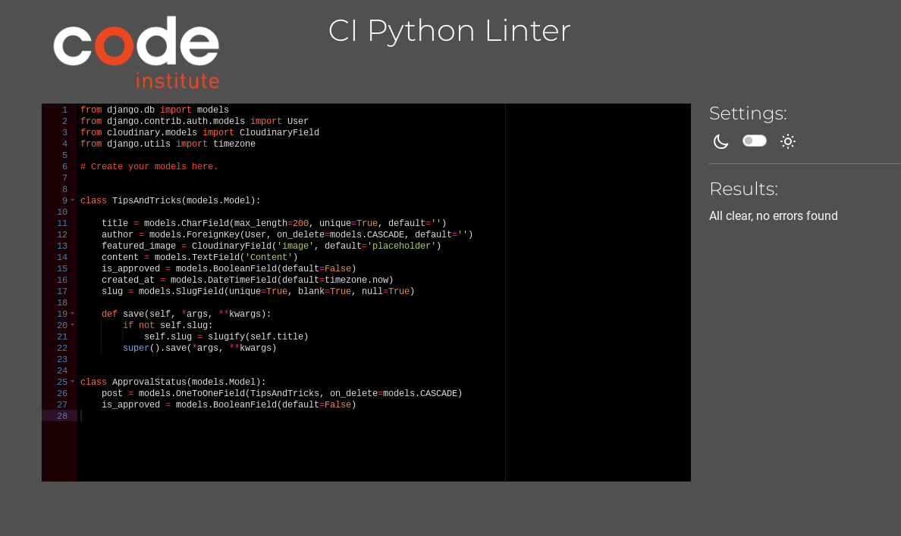 |Pass: No Errors |
| tips_and_tricks | urls.py | [PEP8 CI](https://pep8ci.herokuapp.com/https://raw.githubusercontent.com/Pimmz/Home-Energy-Saving-Store/main/tips_and_tricks/urls.py) |  |Pass: No Errors |
| tips_and_tricks | views.py | [PEP8 CI](https://pep8ci.herokuapp.com/https://raw.githubusercontent.com/Pimmz/Home-Energy-Saving-Store/main/tips_and_tricks/views.py) | 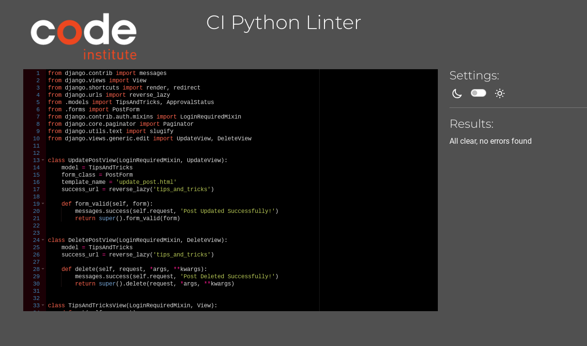 |Pass: No Errors |
|  | manage.py | [PEP8 CI](https://pep8ci.herokuapp.com/https://raw.githubusercontent.com/Pimmz/Home-Energy-Saving-Store/main/manage.py) | 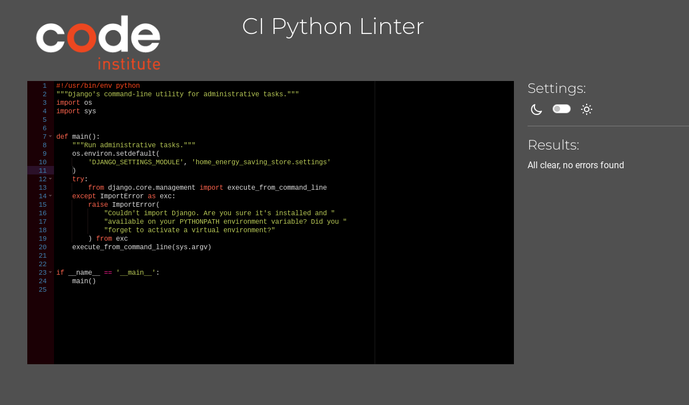 |Pass: No Errors |

## Browser Compatibility

I have tested the Home Energy Saving Store on four different browsers using [Browserling](https://www.browserling.com/). I used this site because you can test multiple browsers in one place for free. The first was Chrome, the second was Firefox, the third was Edge and the fourth was Opera.

- [Chrome](https://www.google.com/chrome)
- [Firefox (Developer Edition)](https://www.mozilla.org/firefox/developer)
- [Edge](https://brave.com/download)
- [Opera](https://www.opera.com/download)

I've tested my deployed project on multiple browsers to check for compatibility issues.

| Browser | Screenshot | Notes |
| --- | --- | --- |
| Chrome |  | Works as expected |
| Firefox | 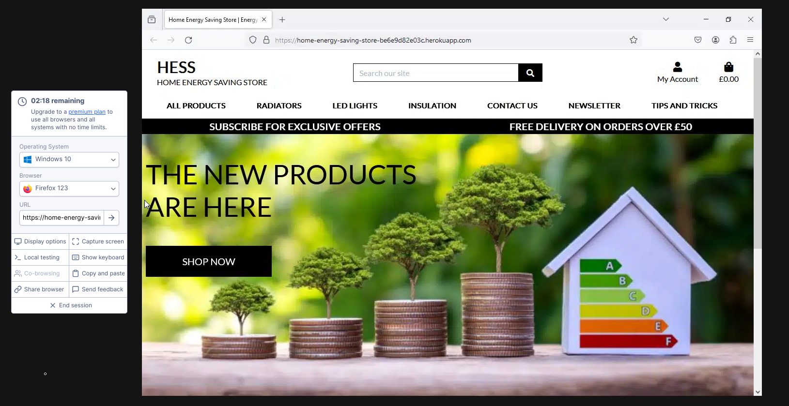 | Works as expected |
| Edge | 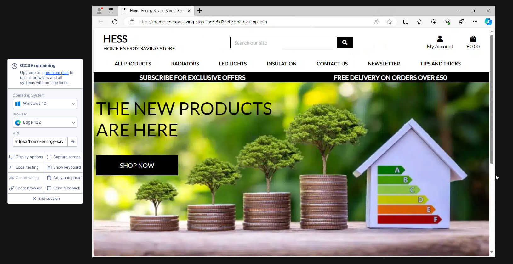 | Works as expected |
| Opera |  | Works as expected |


## Responsiveness

I've tested my deployed project on multiple devices to check for responsiveness issues.

| Device | Screenshot | Notes |
| --- | --- | --- |
| ipad mini |  | Works as expected |
| ipad air |  | Works as expected |
| iphonese | | Works as expected |
| iphone 12 pro |  | Works as expected |
| iphone xr |  | Works as expected |
| Nest hub|  | Works as expected |
| Nest hub Max|  | Works as expected |
| Pixel 7 |  | Works as expected |
| Surface duo |  | Works as expected |
| Galaxy A51 / 71 |  | Works as expected |
| Galaxy S8 |  | Works as expected |
| Galaxy S20 Ultra |  | Works as expected |

## Lighthouse Audit

I've tested my deployed project using the Lighthouse Audit tool to check for any major issues. 

Desktop
| Page | Size | Screenshot | Notes |
| --- | --- | --- | --- |
| Home | Desktop | 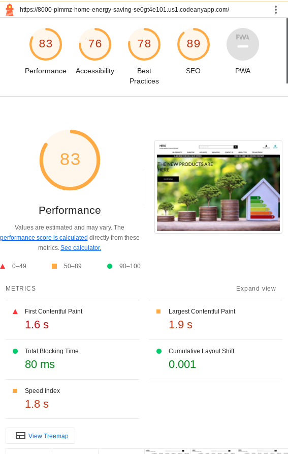 | Few warnings |
| All Products | Desktop |  | Few warnings |
| Radiator | Desktop | 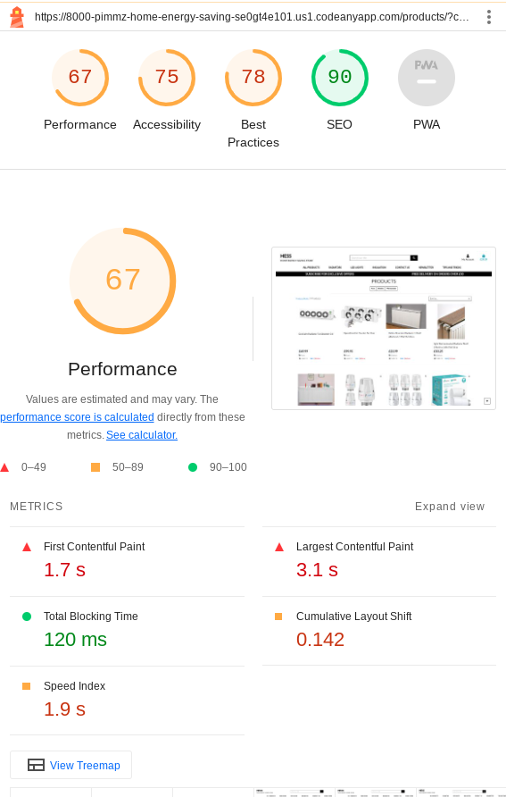 | Worked as expected |
| Led Lights | Desktop | 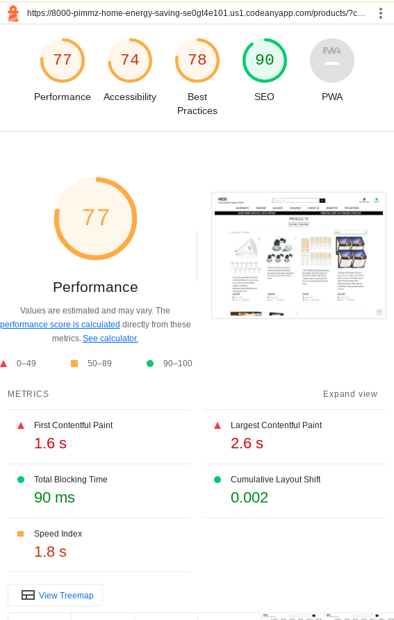 | Worked as expected |
| Insulation | Desktop |  | Worked as expected |
| Contact Us | Desktop | 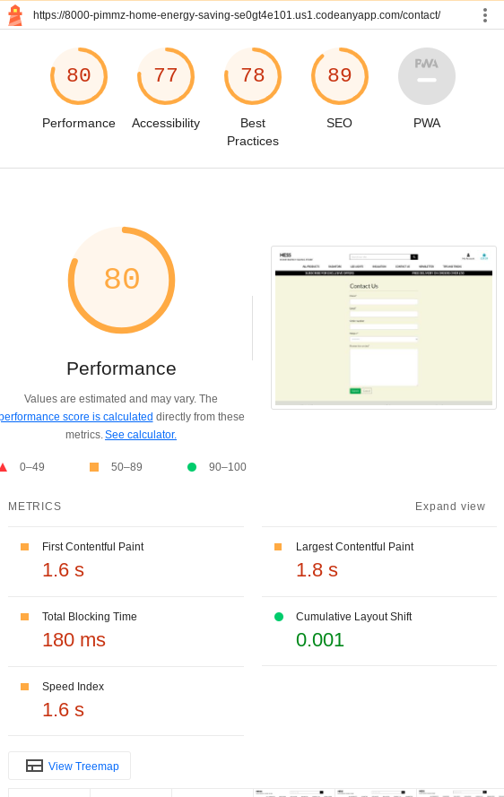 | Worked as expected |
| Newsletter | Desktop |  | Worked as expected |
| Tips and Tricks | Desktop | 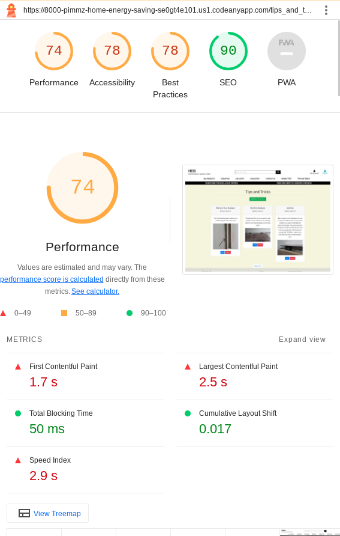 | Worked as expected |
| FAQ | Desktop |  | Average performance due to number of images and size |
| Register | Desktop |  | Good overall though average accessibility |
| Product Management | Desktop |  | Worked as expected  |
| Shopping Bag | Desktop |  | Good overall although accessibility |

Mobile
| Page | Size | Screenshot | Notes |
| --- | --- | --- | --- |
| Home | Mobile | 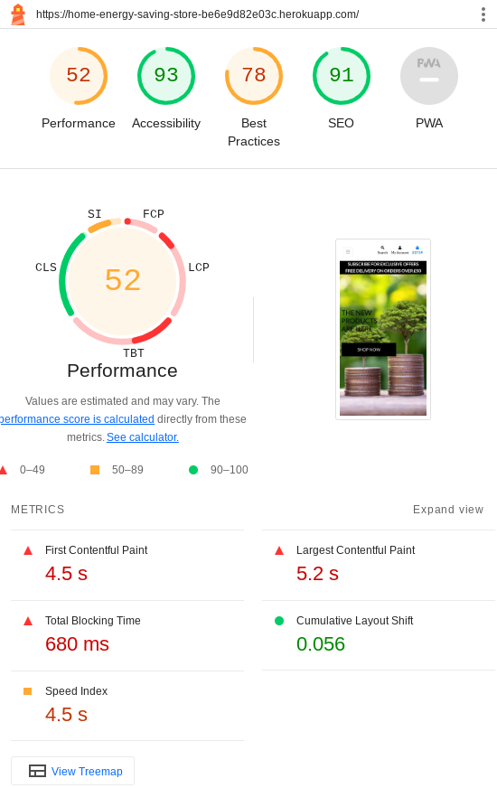 | Slow performance. Compressed and using cloudinary to be more effective. |
| All Products | Mobile | 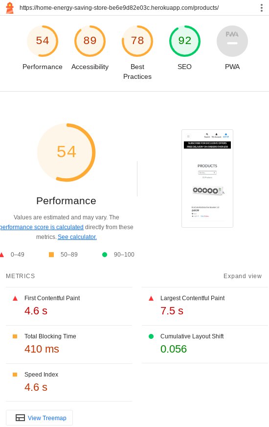 | Slow performance. Compressed and using cloudinary to be more effective|
| Radiator | Desktop |  | Slow performance. Compressed and using cloudinary to be more effective |
| Insulation | Desktop | 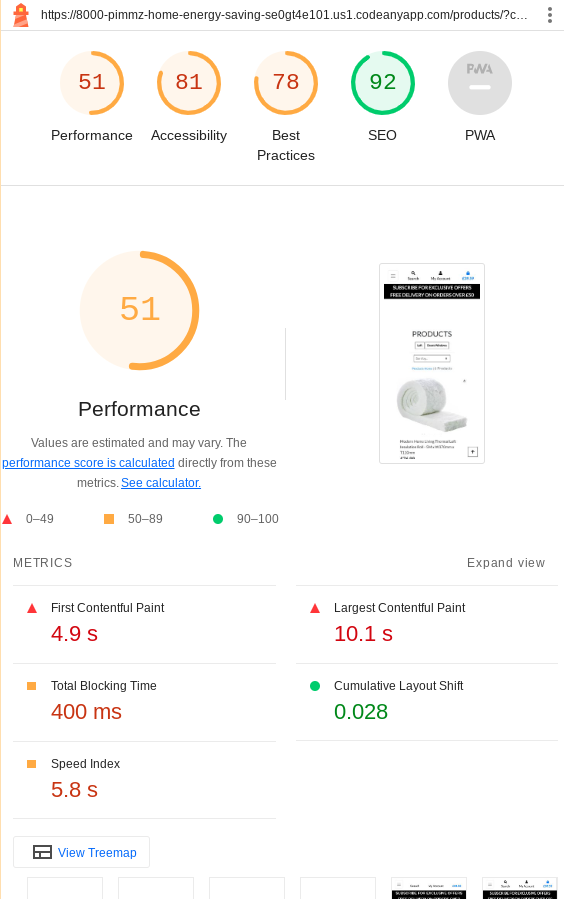 |  Average performance. Everything else is operating as expected|
| Contact Us | Desktop |  | Average performance. Everything else is operating as expected|
| Newsletter | Desktop | 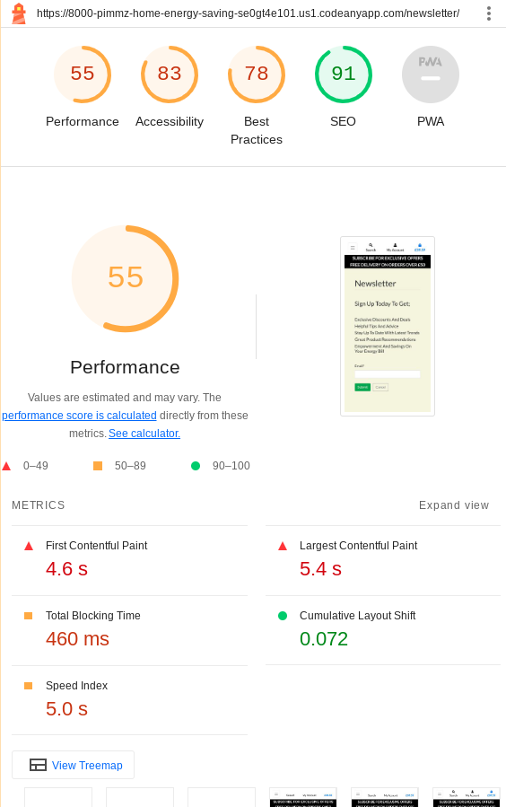 | Average performance. Everything else is operating as expected |
| Tips and Tricks | Desktop | 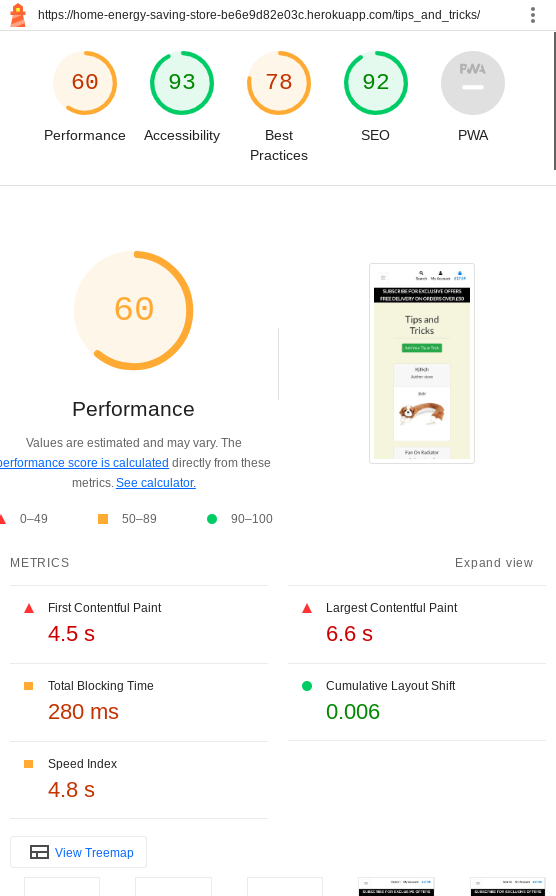 | Slow performance. Compressed and using cloudinary to be more effective |
| FAQ | Desktop |  | Slow performance. Everything else is operating as expected|
| Register| Desktop | 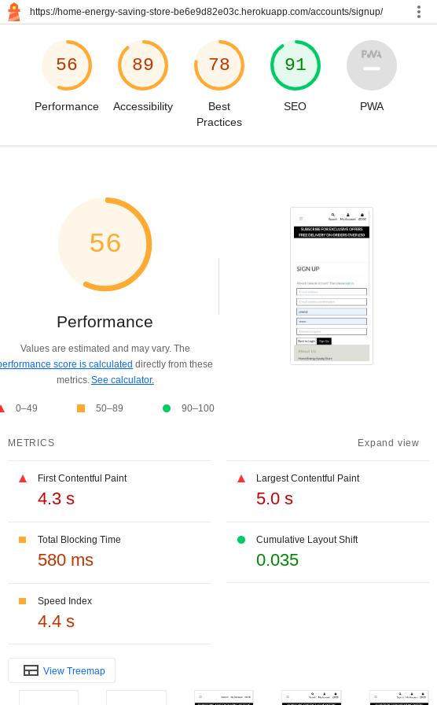 | Slow performance. Compressed and using cloudinary to be more effective |
| Product Maangement | Desktop |  | Average performance. Everything else is operating as expected |
| Shopping Bag | Desktop |  | Slow performance. Compressed and using cloudinary to be more effective |


## Defensive Programming

Defensive programming was manually tested with the below user acceptance testing:

| Page | User Action | Expected Result | Pass/Fail | Comments |
| --- | --- | --- | --- | --- |
| Home Page | | | | |
| | Click on Logo Name | Redirection to Home page | Pass | |
| | Search on search bar | Redirection to chosen product | Pass | |
| | Brute forcing the URL to get to the page for loggin users only  |  User redirected to sign up page | Pass |  |
| All Products Page | | | | |
| | Click on All Products link in navbar | Redirection to All products page | Pass | |
| | Click on image | redirection to larger image of product | Pass | |
| | Change sort by method | Products arranged in the order chosen | Pass | |
| | Brute forcing the URL to get to another user's profile | Redirects user back to own profile | Pass | |
| Radiator Page | | | | |
| | Click on All Products link in navbar | Redirection to All products page | Pass | |
| | Click on image | redirection to larger image of product | Pass | |
| | Change sort by method | Products arranged in the order chosen | Pass | |
| | Brute forcing the URL to get to another user's profile | Redirects user back to own profile | Pass | |
| Led Lights Page | | | | |
| | Click on All Products link in navbar | Redirection to All products page | Pass | |
| | Click on image | redirection to larger image of product | Pass | |
| | Change sort by method | Products arranged in the order chosen | Pass | |
| | Brute forcing the URL to get to another user's profile | Redirects user back to own profile | Pass | |
| Insulation Page | | | | |
| | Click on All Products link in navbar | Redirection to All products page | Pass | |
| | Click on image | redirection to larger image of product | Pass | |
| | Change sort by method | Products arranged in the order chosen | Pass | |
| | Brute forcing the URL to get to another user's profile | Redirects user back to own profile | Pass | |
| Contact us Page | | | | |
| | Enter name | Field will accept freeform text | Pass | |
| | Enter valid email address | Field will only accept email address format | Pass | |
| | Select subject from the drop-down menu | User can only choose from the three available choices| Pass | |
| | Enter message in textarea | Field will accept freeform text | Pass | |
| | No message in textareas | error message appears stating this field is required | Pass | |
| | Click the Submit button | Message pops up informing them their message as been successful | Pass |  |
| | Click on the Cancel button | User will be redirected to the Home page  | Pass | |
| Newsletter Page | | | | |
| | Enter valid email address | Field will only accept email address format | Pass | |
| | If the user has already registered their email a message will come up saying so and highlighted in red.| |
| | Click the Submit button | Send the email and displays a message saying it was successful | Pass |  |
| | Click on the Cancel button | User will be redirected to the Home page  | Pass | |
| | Brute forcing the URL to get to another user's profile | User will not be allowed access | Pass | Redirects user back to own profile |
| Tips and Tricks Page | | | | |
| | Click on the Add tip or trick button | Redirection to Add tip and trick page | Pass | |
| | Enter Title | Field will accept freeform text | Pass | |
| | Enter Content | Field will accept freeform text | Pass | |
| | Click on Choose Image button |  Choose your image you want to upload| Pass | |
| | Click the Submit button | Redirects user to the tips and tricks page  | Pass |  |
| | Click on edit button | User will be redirected to the update post page | Pass | |
| | Click the Delete button | Redirects user to tips and tricks  | Pass | checks if its ok to delete |
| | Brute forcing the URL to get to another user's profile | Redirects user back to own profile | Pass | |
| FAQ Page | | | | |
| | Click frequently asked questions | directed to the FAQ page | Pass | |
| | Brute forcing the URL to get to another user's profile | Redirects user back to own profile | Pass | |
| Register Page | | | | |
| | Click on the register Button | Redirection to register page | Pass | |
| | Enter valid email address | Field will only accept email address format | Pass | |
| | password | Field will only accept valid password format | Pass | |
| | Click the sign up button | Redirects user to the home page  | Pass |  |
| | Click on the back to login button | User will be redirected to the login page  | Pass | |
| | Brute forcing the URL to get to another user's profile | Redirects user back to own profile | Pass | |
| Product Management Page | | | | |
| | Select category from the drop-down menu | User can only choose from the seven available choices| Pass | |
| | Enter Content | Field will accept freeform text | Pass | |
| | Click on Choose Image button |  Choose your image you want to upload| Pass | |
| | Click on the Add product Button | Redirection to products page | Pass | |
| | Click on the Cancel button | User will be redirected to the products page  | Pass | |
| | Brute forcing the URL to get to another user's profile | Redirects user back to own profile | Pass | |
| Shopping Bag Page | | | | |
| | Click on the qty button | changes the quantity of the item purchased | Pass | Confirms delete first|
| | Click on update button | updates the qty of the item the user has changed | Pass | |
| | Click the remove button | removes the product selected | Pass | |
| | Click on the keep shopping button | User will be redirected to the prod page  | Pass | |
| | Click on the secure checkout button | User will be redirected to the checkout page  | Pass | |
| | Brute forcing the URL to get to another user's profile | Redirects user back to own profile | Pass | |
| Log Out | | | | |
| | Click sign out button | Redirects user to sign out page | Pass | Confirms logout first |
| | Click on the Cancel button | User will be redirected to the home page  | Pass | |

## User Story Testing

🛑🛑🛑🛑🛑🛑🛑🛑🛑🛑-START OF NOTES (to be deleted)

Testing user stories is actually quite simple, once you've already got the stories defined on your README.

Most of your project's **features** should already align with the **user stories**,
so this should as simple as creating a table with the user story, matching with the re-used screenshot
from the respective feature.

🛑🛑🛑🛑🛑🛑🛑🛑🛑🛑-END OF NOTES (to be deleted)

| User Story | Screenshot |
| --- | --- |
| As a new site user, I would like to ____________, so that I can ____________. |  |
| As a new site user, I would like to ____________, so that I can ____________. |  |
| As a new site user, I would like to ____________, so that I can ____________. |  |
| As a returning site user, I would like to ____________, so that I can ____________. |  |
| As a returning site user, I would like to ____________, so that I can ____________. |  |
| As a returning site user, I would like to ____________, so that I can ____________. |  |
| As a site administrator, I should be able to ____________, so that I can ____________. |  |
| As a site administrator, I should be able to ____________, so that I can ____________. |  |
| As a site administrator, I should be able to ____________, so that I can ____________. |  |
| repeat for all remaining user stories | x |

## Automated Testing

I have conducted a series of automated tests on my application.

I fully acknowledge and understand that, in a real-world scenario, an extensive set of additional tests would be more comprehensive.

### JavaScript (Jest Testing)

🛑🛑🛑🛑🛑🛑🛑🛑🛑🛑-START OF NOTES (to be deleted)

Adjust the code below (file names, etc.) to match your own project files/folders.

🛑🛑🛑🛑🛑🛑🛑🛑🛑🛑-END OF NOTES (to be deleted)

I have used the [Jest](https://jestjs.io) JavaScript testing framework to test the application functionality.

In order to work with Jest, I first had to initialize NPM.

- `npm init`
- Hit `enter` for all options, except for **test command:**, just type `jest`.

Add Jest to a list called **Dev Dependencies** in a dev environment:

- `npm install --save-dev jest`

**IMPORTANT**: Initial configurations

When creating test files, the name of the file needs to be `file-name.test.js` in order for Jest to properly work.

Without the following, Jest won't properly run the tests:

- `npm install -D jest-environment-jsdom`

Due to a change in Jest's default configuration, you'll need to add the following code to the top of the `.test.js` file:

```js
/**
 * @jest-environment jsdom
 */

const { test, expect } = require("@jest/globals");
const { function1, function2, function3, etc. } = require("../script-name");

beforeAll(() => {
    let fs = require("fs");
    let fileContents = fs.readFileSync("index.html", "utf-8");
    document.open();
    document.write(fileContents);
    document.close();
});
```

Remember to adjust the `fs.readFileSync()` to the specific file you'd like you test.
The example above is testing the `index.html` file.

Finally, at the bottom of the script file where your primary scripts are written, include the following at the bottom of the file.
Make sure to include the name of all of your functions that are being tested in the `.test.js` file.

```js
if (typeof module !== "undefined") module.exports = {
    function1, function2, function3, etc.
};
```

Now that these steps have been undertaken, further tests can be written, and be expected to fail initially.
Write JS code that can get the tests to pass as part of the Red-Green refactor process.

Once ready, to run the tests, use this command:

- `npm test`

**NOTE**: To obtain a coverage report, use the following command:

- `npm test --coverage`

Below are the results from the tests that I've written for this application:

| Test Suites | Tests | Screenshot |
| --- | --- | --- |
| 1 passed | 16 passed |  |
| x | x | repeat for all remaining tests |

#### Jest Test Issues

🛑🛑🛑🛑🛑🛑🛑🛑🛑🛑-START OF NOTES (to be deleted)

Use this section to list any known issues you ran into while writing your Jest tests.
Remember to include screenshots (where possible), and a solution to the issue (if known).

This can be used for both "fixed" and "unresolved" issues.

🛑🛑🛑🛑🛑🛑🛑🛑🛑🛑-END OF NOTES (to be deleted)

### Python (Unit Testing)

🛑🛑🛑🛑🛑🛑🛑🛑🛑🛑-START OF NOTES (to be deleted)

Adjust the code below (file names, etc.) to match your own project files/folders.

🛑🛑🛑🛑🛑🛑🛑🛑🛑🛑-END OF NOTES (to be deleted)

I have used Django's built-in unit testing framework to test the application functionality.

In order to run the tests, I ran the following command in the terminal each time:

`python3 manage.py test name-of-app `

To create the coverage report, I would then run the following commands:

`coverage run --source=name-of-app manage.py test`

`coverage report`

To see the HTML version of the reports, and find out whether some pieces of code were missing, I ran the following commands:

`coverage html`

`python3 -m http.server`

Below are the results from the various apps on my application that I've tested:

| App | File | Coverage | Screenshot |
| --- | --- | --- | --- |
| Bag | test_forms.py | 99% |  |
| Bag | test_models.py | 89% |  |
| Bag | test_urls.py | 100% |  |
| Bag | test_views.py | 71% |  |
| Checkout | test_forms.py | 99% |  |
| Checkout | test_models.py | 89% |  |
| Checkout | test_urls.py | 100% |  |
| Checkout | test_views.py | 71% |  |
| Home | test_forms.py | 99% |  |
| Home | test_models.py | 89% |  |
| Home | test_urls.py | 100% |  |
| Home | test_views.py | 71% |  |
| Products | test_forms.py | 99% |  |
| Products | test_models.py | 89% |  |
| Products | test_urls.py | 100% |  |
| Products | test_views.py | 71% |  |
| Profiles | test_forms.py | 99% |  |
| Profiles | test_models.py | 89% |  |
| Profiles | test_urls.py | 100% |  |
| Profiles | test_views.py | 71% |  |
| x | x | x | repeat for all remaining tested apps/files |

#### Unit Test Issues

🛑🛑🛑🛑🛑🛑🛑🛑🛑🛑-START OF NOTES (to be deleted)

Use this section to list any known issues you ran into while writing your unit tests.
Remember to include screenshots (where possible), and a solution to the issue (if known).

This can be used for both "fixed" and "unresolved" issues.

🛑🛑🛑🛑🛑🛑🛑🛑🛑🛑-END OF NOTES (to be deleted)

## Bugs

🛑🛑🛑🛑🛑🛑🛑🛑🛑🛑-START OF NOTES (to be deleted)

This section is primarily used for JavaScript and Python applications,
but feel free to use this section to document any HTML/CSS bugs you might run into.

It's very important to document any bugs you've discovered while developing the project.
Make sure to include any necessary steps you've implemented to fix the bug(s) as well.

**PRO TIP**: screenshots of bugs are extremely helpful, and go a long way!

🛑🛑🛑🛑🛑🛑🛑🛑🛑🛑-END OF NOTES (to be deleted)

- JS Uncaught ReferenceError: `foobar` is undefined/not defined

    

    - To fix this, I _____________________.

- JS `'let'` or `'const'` or `'template literal syntax'` or `'arrow function syntax (=>)'` is available in ES6 (use `'esversion: 11'`) or Mozilla JS extensions (use moz).

    

    - To fix this, I _____________________.

- Python `'ModuleNotFoundError'` when trying to import module from imported package

    

    - To fix this, I _____________________.

- Django `TemplateDoesNotExist` at /appname/path appname/template_name.html

    

    - To fix this, I _____________________.

- Python `E501 line too long` (93 > 79 characters)

    

    - To fix this, I _____________________.

### GitHub **Issues**

🛑🛑🛑🛑🛑🛑🛑🛑🛑🛑-START OF NOTES (to be deleted)

An improved way to manage bugs is to use the built-in **Issues** tracker on your GitHub repository.
To access your Issues, click on the "Issues" tab at the top of your repository.
Alternatively, use this link: https://github.com/Pimmz/Home-Energy-Saving-Store/issues

If using the Issues tracker for your bug management, you can simplify the documentation process.
Issues allow you to directly paste screenshots into the issue without having to first save the screenshot locally,
then uploading into your project.

You can add labels to your issues (`bug`), assign yourself as the owner, and add comments/updates as you progress with fixing the issue(s).

Once you've sorted the issue, you should then "Close" it.

When showcasing your bug tracking for assessment, you can use the following format:

🛑🛑🛑🛑🛑🛑🛑🛑🛑🛑-END OF NOTES (to be deleted)

**Fixed Bugs**

[](https://github.com/Pimmz/Home-Energy-Saving-Store/issues?q=is%3Aissue+is%3Aclosed+label%3Abug)

All previously closed/fixed bugs can be tracked [here](https://github.com/Pimmz/Home-Energy-Saving-Store/issues?q=is%3Aissue+is%3Aclosed).

| Bug | Status |
| --- | --- |
| [JS Uncaught ReferenceError: `foobar` is undefined/not defined](https://github.com/Pimmz/Home-Energy-Saving-Store/issues/1) | Closed |
| [Python `'ModuleNotFoundError'` when trying to import module from imported package](https://github.com/Pimmz/Home-Energy-Saving-Store/issues/2) | Closed |
| [Django `TemplateDoesNotExist` at /appname/path appname/template_name.html](https://github.com/Pimmz/Home-Energy-Saving-Store/issues/3) | Closed |

**Open Issues**

[](https://github.com/Pimmz/Home-Energy-Saving-Store/issues)
[](https://github.com/Pimmz/Home-Energy-Saving-Store/issues?q=is%3Aissue+is%3Aclosed)

Any remaining open issues can be tracked [here](https://github.com/Pimmz/Home-Energy-Saving-Store/issues).

| Bug | Status |
| --- | --- |
| [JS `'let'` or `'const'` or `'template literal syntax'` or `'arrow function syntax (=>)'` is available in ES6 (use `'esversion: 11'`) or Mozilla JS extensions (use moz).](https://github.com/Pimmz/Home-Energy-Saving-Store/issues/4) | Open |
| [Python `E501 line too long` (93 > 79 characters)](https://github.com/Pimmz/Home-Energy-Saving-Store/issues/5) | Open |

## Unfixed Bugs

🛑🛑🛑🛑🛑🛑🛑🛑🛑🛑-START OF NOTES (to be deleted)

You will need to mention unfixed bugs and why they were not fixed.
This section should include shortcomings of the frameworks or technologies used.
Although time can be a big variable to consider, paucity of time and difficulty understanding
implementation is not a valid reason to leave bugs unfixed.

If you've identified any unfixed bugs, no matter how small, be sure to list them here.
It's better to be honest and list them, because if it's not documented and an assessor finds the issue,
they need to know whether or not you're aware of them as well, and why you've not corrected/fixed them.

Some examples:

🛑🛑🛑🛑🛑🛑🛑🛑🛑🛑-END OF NOTES (to be deleted)

- On devices smaller than 375px, the page starts to have `overflow-x` scrolling.

    

    - Attempted fix: I tried to add additional media queries to handle this, but things started becoming too small to read.

- For PP3, when using a helper `clear()` function, any text above the height of the terminal does not clear, and remains when you scroll up.

    

    - Attempted fix: I tried to adjust the terminal size, but it only resizes the actual terminal, not the allowable area for text.

- When validating HTML with a semantic `section` element, the validator warns about lacking a header `h2-h6`. This is acceptable.

    

    - Attempted fix: this is a known warning and acceptable, and my section doesn't require a header since it's dynamically added via JS.

🛑🛑🛑🛑🛑🛑🛑🛑🛑🛑-START OF NOTES (to be deleted)

If you legitimately cannot find any unfixed bugs or warnings, then use the following sentence:

🛑🛑🛑🛑🛑🛑🛑🛑🛑🛑-END OF NOTES (to be deleted)

> [!NOTE]  
> There are no remaining bugs that I am aware of.
